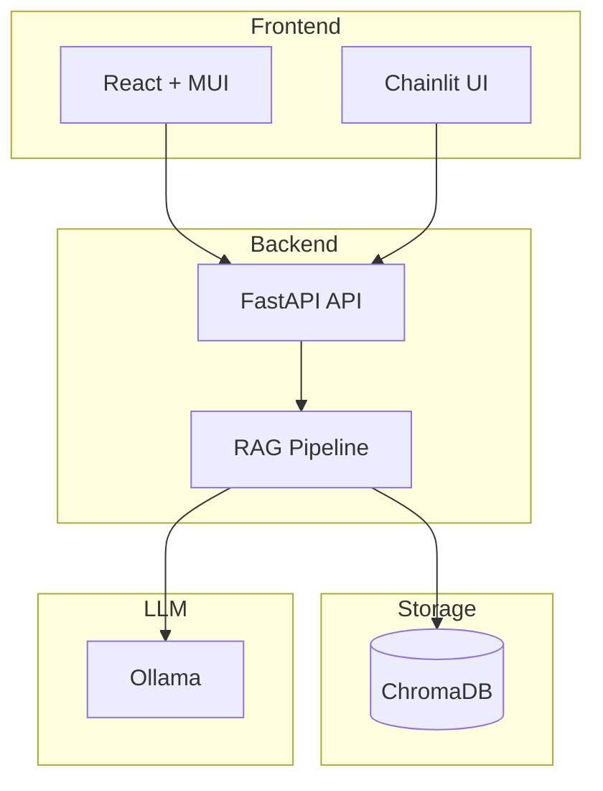

# On-Premises RAG Solution

[](https://www.python.org/downloads/)
[](LICENSE)
[](https://github.com/pkuppens/on_prem_rag/actions/workflows/python-ci.yml/badge.svg)
[](https://github.com/pkuppens/on_prem_rag/actions/workflows/python-ci.yml)
[](https://github.com/pkuppens/on_prem_rag/actions/workflows/python-ci.yml)

_Talk with your documents and data using LLMs without Cloud privacy and confidentiality concerns_

## Executive Summary

A production-ready RAG system designed for **regulated environments where data cannot leave the premises**. Built with healthcare compliance in mind, this on-premises Retrieval-Augmented Generation solution lets clinicians and staff query documents and databases using Large Language Models (LLMs) without exposing patient data to the cloud.

Data stays on your infrastructure. The system supports GDPR, NEN 7510 (Dutch healthcare information security), and HIPAA-aware deployments. Every answer includes source attribution so clinicians can verify where information comes from—supporting clinical decision-making and audit requirements.

The architecture embraces the **Model‑Context‑Protocol (MCP)** for standardized context exchange between components. Organizations can run document analysis, natural-language querying, and database lookups entirely on-premises.

## Design Decisions

Key architectural trade-offs that shape the system:

| Decision                 | Choice                                        | Rationale                                                                                                                           |
| ------------------------ | --------------------------------------------- | ----------------------------------------------------------------------------------------------------------------------------------- |
| **Architecture**         | Local-first, on-premises                      | Data sovereignty and compliance; no cloud dependency for core flows                                                                 |
| **Stack**                | Open source (MIT, Apache 2.0)                 | Auditability, no vendor lock-in, community support                                                                                  |
| **Structure**            | Modular, swappable components                 | Chunking, retrieval, embeddings, and LLM backends can be swapped or configured for different purposes and experimentation           |
| **Embeddings**           | Multilingual-E5-large-instruct (default)      | Swappable; default chosen from literature for on-prem, 100+ languages, MIT license; see [EMBEDDING.md](docs/technical/EMBEDDING.md) |
| **Chunking**             | 512 chars, 50 overlap (default, configurable) | Swappable strategies; defaults follow LlamaIndex best practices; see [CHUNKING.md](docs/technical/CHUNKING.md)                      |
| **LLM backends**         | Ollama, HuggingFace, LiteLLM                  | Configurable via env vars; supports local and optional cloud providers                                                              |
| **Vector store**         | ChromaDB                                      | Local, embeddable, no external service required                                                                                     |
| **Retrieval (explored)** | Knowledge-graph augmentation                  | Emerging technique for better RAG; candidate for future implementation (track in dedicated issue)                                   |

For legal, commercial, and pending decisions, see [Key Business Concerns & Decisions](#key-business-concerns--decisions).

## What We'll Build




### Business Value Proposition

- **Data Privacy & Compliance**: Zero cloud dependencies ensure sensitive information never leaves your infrastructure
- **Cost Control**: Eliminate per-query API costs and unpredictable cloud billing
- **Regulatory Compliance**: Meet GDPR, HIPAA, SOX, and other regulatory requirements
- **Operational Independence**: No internet dependency for core functionality

## Strategic Goals

Our implementation addresses six core business objectives through a structured SAFe approach:

1. **[Technical Foundation](project/program/features/FEAT-001.md)**: Robust development environment and MVP implementation
2. **[Enterprise User Interface](project/program/features/FEAT-002.md)**: Intuitive GUI with enterprise-grade role-based access control
3. **[Flexible LLM Integration](project/program/features/FEAT-003.md)**: Justified tool selection with clear rationale for choices and rejections
4. **[Database Query Capabilities](project/program/features/FEAT-004.md)**: Natural language to SQL functionality
5. **[Production Deployment](project/program/features/FEAT-005.md)**: Containerized deployment with optimized Python and LLM integration
6. **[Security Framework](project/program/features/FEAT-006.md)**: Comprehensive security and access control implementation

## Repository Overview

This repository contains the complete SAFe project structure under [`docs/`](docs/),
including epics, features, stories, and tasks that guide development. Source
code will be added as the tasks in the `team` folder are implemented. The first
milestone focuses on document question-answering, while database NLP/SQL
capabilities are planned for later phases.

### Authentication Service

A lightweight authentication microservice (`auth_service`) handles username/password
registration and login while exposing placeholder OAuth2 endpoints for Google and Outlook.
Start it with:

```bash
uv run start-auth
```

## Key Business Concerns & Decisions

### Legal & Licensing Considerations

| Concern                      | Status                  | Decision Framework                             |
| ---------------------------- | ----------------------- | ---------------------------------------------- |
| **Commercial LLM Usage**     | ⚠️ Research Phase       | Evaluate Apache 2.0 vs proprietary licenses    |
| **Open Source Dependencies** | ✅ Approved Strategy    | Use permissive licenses (MIT, Apache 2.0) only |
| **Data Governance**          | ⚠️ Policy Required      | Define data retention and access policies      |
| **Liability & Warranty**     | ❌ Pending Legal Review | Establish liability framework for AI outputs   |

### Commercial Considerations

#### Initial Investment

- **Development Time**: 6-8 weeks for MVP, 12-16 weeks for production
- **Infrastructure**: Dedicated GPU server(s) for optimal performance
- **Licensing**: Zero ongoing cloud costs, one-time development investment

#### ROI Drivers

- **Eliminated Cloud Costs**: Typical enterprise saves $50K-200K annually
- **Compliance Risk Mitigation**: Avoid potential regulatory fines
- **Productivity Gains**: 40-60% faster document research and analysis

### Technology Trade-offs

#### Core Decisions Made

- **Local-First Architecture**: Complete offline capability vs. cloud performance
- **Open Source Stack**: Community support vs. enterprise vendor support
- **Modular Design**: Flexibility vs. integration complexity

#### Decisions Pending

- **LLM Model Selection**: Performance vs. resource requirements
- **Authentication Provider**: Built-in vs. enterprise SSO integration
- **Database Scope**: Document-only vs. full database integration

## Implementation Roadmap

The roadmap below intentionally prioritizes document-based question answering
before adding any database NLP/SQL features. A working document pipeline is
critical for validating the overall architecture.

### Phase 1: Foundation (Weeks 1-4)

- Core RAG pipeline with document ingestion
- Document question-answering pipeline
- Basic web interface for proof-of-concept
- Docker-based deployment

## Quick Start with Docker Compose

Clone the repository and run:

```bash
docker-compose up --build
```

This launches ChromaDB, the FastAPI backend, the React frontend and an Ollama
container. Visit the frontend at http://localhost:5173. If you already run an
Ollama container separately, comment out the `ollama` service in
`docker-compose.yml` and set `OLLAMA_BASE_URL` accordingly.

## Multi-Root Workspace Configuration

This project can be configured as a multi-root workspace to integrate the related WBSO-AICM-2025-01 repository for seamless code navigation and search across both codebases.

**To set up the workspace:**

1. Create or open the workspace file (`on_prem_rag.code-workspace`) in the project root
2. Adjust the path to the WBSO-AICM-2025-01 repository for your system:

   ```json
   {
     "folders": [
       {
         "name": "On-Premises RAG",
         "path": "."
       },
       {
         "name": "WBSO-AICM-2025-01",
         "path": "C:\\Users\\piete\\Repos\\pkuppens\\WBSO-AICM-2025-01"
       }
     ]
   }
   ```

3. Open the workspace file in Cursor/VS Code:
   ```bash
   cursor on_prem_rag.code-workspace
   ```

**Benefits:**

- Cross-repository code search and navigation
- Unified context for AI assistance
- Shared settings and configurations
- Integrated development workflow

**Note:** The workspace file uses absolute paths and is gitignored (`.gitignore` includes `*.code-workspace`) since paths are user-specific. Each developer should create their own workspace file with paths adjusted for their system.

## Local Development Setup

To run the tests or work on the code outside containers, install the Python dependencies using `uv`. Network access is required when installing packages.

```bash
# Create venv and install all dependencies (including dev tools)
uv sync --group dev

# Install git hooks for pre-commit (lint, format, etc.)
pre-commit install

# Set up git hooks for unit test enforcement (run once after cloning)
uv run python scripts/setup_git_hooks.py
```

**Verify setup** by running:

```bash
uv run pytest                              # Run tests (excludes slow and internet by default)
pre-commit run --all-files                 # Run all pre-commit hooks (first run may auto-fix some files)
```

No manual venv activation is needed—`uv run` uses the project environment automatically on all platforms.

**Note**: The project uses a src-layout structure. `uv sync` installs the package in editable mode so the test suite can import modules from `src/`, `scripts/`, and `project/` directories.

### Git Push Enforcement

The project enforces unit test passing on every git push via pre-push hooks:

- **Automatic**: Unit tests run before every push
- **Fast**: Only runs fast unit tests (excludes slow and internet tests)
- **Blocking**: Push is blocked if tests fail
- **Emergency Bypass**: Use `git push --no-verify` in emergencies

See [docs/technical/GIT_HOOKS.md](docs/technical/GIT_HOOKS.md) for detailed documentation.

### Development Standards

- **Import Style**: Use absolute imports (`from scripts import module_name`) instead of relative imports
- **Testing**: All tests must pass before commits. Run tests with: `uv run pytest`
- **Linting**: All code must pass linting checks before commits. Run linting with:

  ```bash
  # First run: Auto-fix issues
  uv run ruff check --fix .

  # Second run: Format code
  uv run ruff format .

  # Third run: Verify everything is clean
  uv run ruff check . && uv run ruff format --check .
  ```

- **Package Management**: Configuration is handled through `pyproject.toml` for portable development environments
- **Dependency Management**:
  - **CRITICAL**: Always use `uv add package-name` for new dependencies - NEVER use `pip install`
  - `pip install` only works locally but fails in fresh environments (CI/CD, containers)
  - Before importing any package, verify it exists in `pyproject.toml` or add it with `uv add`
  - Use `uv sync` to install dependencies in fresh environments
- **CI/CD**: Check GitHub Actions results before creating pull requests

See [docs/SETUP.md](docs/SETUP.md) and [docs/pre-commit-hooks.md](docs/pre-commit-hooks.md) for additional details.

### Phase 2: Enterprise Features (Weeks 5-8)

- Role-based access control
- Multi-user support
- Security hardening

### Phase 3: Advanced Capabilities (Weeks 9-12)

- Database natural language queries
- Multi-LLM support
- Performance optimization

## Risk Assessment

| Risk Category                | Impact | Mitigation Strategy                               |
| ---------------------------- | ------ | ------------------------------------------------- |
| **Model Performance**        | Medium | Extensive testing with business-relevant datasets |
| **Security Vulnerabilities** | High   | Third-party security audit before production      |
| **Resource Requirements**    | Medium | Scalable deployment architecture                  |
| **User Adoption**            | Low    | Intuitive UI design and comprehensive training    |

## Troubleshooting

### Common Setup Issues

#### 1. Module Import Errors

**Symptoms:**

- `ModuleNotFoundError: No module named 'auth_service'`
- `ModuleNotFoundError: No module named 'rag_pipeline'`
- `ModuleNotFoundError: No module named 'httpx'`
- Services fail to start with import-related errors

**Solution:**

```bash
uv sync --group dev
uv run pytest tests/test_imports.py -v
```

**Explanation:** The project uses a src-layout structure where all modules are inside the `src/` directory. `uv sync --group dev` creates the venv and installs the project in editable mode.

**uv Command Usage:**

- `uv sync --group dev` - Install project and all dependencies (use for setup and fresh environments)
- `uv add package-name` - Add external dependencies to pyproject.toml (use for new packages)

#### 2. uv Command Not Found

**Symptoms:**

- `uv: command not found`
- `'uv' is not recognized as an internal or external command`

**Solution:**

```bash
# Install uv using one of these methods:
# Windows (using winget)
winget install astral-sh.uv

# Or using pip
pip install uv

# Or using curl (Linux/macOS)
curl -LsSf https://astral.sh/uv/install.sh | sh

# Verify installation
uv --version
```

#### 3. Python Version Issues

**Symptoms:**

- Wrong Python version being used
- Version conflicts between system and project Python

**Solution:**

```bash
# Check available Python versions
uv python list

# Install specific version
uv python install 3.13.2

# uv sync uses pyproject.toml's requires-python; to force a version:
uv sync --group dev --python 3.13.2

# Verify version
uv run python --version
```

#### 4. Dependency Installation Failures

**Symptoms:**

- Package installation fails
- Network timeouts during installation
- Disk space errors

**Solution:**

```bash
# Check disk space
df -h  # Linux/macOS
dir C:\  # Windows

# Clear caches and retry
uv cache clean --all
rm -rf ~/.cache/pip ~/.cache/uv

# Force reinstall
uv sync --force-reinstall

# Verbose installation for debugging
uv sync --verbose
```

#### 5. Network/Proxy Issues

**Symptoms:**

- Connection timeouts to PyPI
- SSL certificate errors
- Proxy authentication failures

**Solution:**

```bash
# Configure proxy if needed
export HTTP_PROXY=http://proxy.company.com:8080
export HTTPS_PROXY=http://proxy.company.com:8080

# Test connectivity
curl -I https://pypi.org/simple/

# Use alternative index
uv sync --index-url https://pypi.org/simple/
```

#### 6. Pre-commit Hook Failures

**Symptoms:**

- Hooks fail during commit
- Formatting or linting errors
- Test failures in pre-commit

**Solution:**

```bash
# Run hooks manually to see detailed errors
pre-commit run --all-files

# Fix formatting issues
uv run ruff format .

# Fix linting issues
uv run ruff check . --fix

# Run tests to identify failures
uv run pytest
```

#### 7. Docker Compose Issues

**Symptoms:**

- Services fail to start
- Port conflicts
- Volume mounting errors

**Solution:**

```bash
# Check for port conflicts
netstat -tulpn | grep :5173  # Linux
netstat -an | findstr :5173  # Windows

# Clean up and restart
docker-compose down
docker-compose up --build

# Check logs for specific service
docker-compose logs [service-name]
```

#### 8. Frontend Development Issues

**Symptoms:**

- Blank page at http://localhost:5173
- Console errors about missing modules
- TypeScript compilation errors

**Solution:**

```bash
cd src/frontend

# Clear and reinstall dependencies
rm -rf node_modules package-lock.json
npm install

# Build and start dev server
npm run build
npm run dev

# Test isolated component (bypasses auth)
# Visit: http://localhost:5173/?test=theme
```

### Environment-Specific Issues

#### Windows-Specific

- **Path issues**: Ensure Python and uv are in your PATH
- **Permission errors**: Run terminal as Administrator if needed
- **Line ending issues**: Use Git with `core.autocrlf=true`

#### Linux/macOS-Specific

- **Permission denied**: Use `chmod +x` for scripts
- **Missing system dependencies**: Install build tools (`build-essential` on Ubuntu)

### Getting Help

1. **Check logs**: Look at service logs for detailed error messages
2. **Verify environment**: Run `uv run pytest tests/test_imports.py -v`
3. **Clean rebuild**: Remove `.venv` and `uv.lock` (if present), then run `uv sync --group dev`
4. **Check documentation**: See [docs/SETUP.md](docs/SETUP.md) for detailed setup instructions
5. **Network issues**: Ensure access to required domains (pypi.org, huggingface.co, github.com)

### Recovery Commands

```bash
# Complete environment reset
rm -rf .venv uv.lock
uv cache clean --all
uv sync --group dev

# Verify everything works
uv run pytest
docker-compose up --build
```

## Next Steps for Leadership

1. **Legal Review**: Engage legal team for licensing and liability framework
2. **Infrastructure Planning**: Provision development and production hardware
3. **Stakeholder Alignment**: Define success metrics and acceptance criteria
4. **Security Assessment**: Plan security audit and penetration testing
5. **Change Management**: Develop user training and adoption strategy

---

**Project Documentation**: Detailed SAFe project structure available in [`project/`](project/)
**Strategic Overview**: Complete business case in [`project/SAFe Project Plan.md`](project/SAFe%20Project%20Plan.md)
**Project Status**: Development Phase - MVP in progress
**Last Updated**: 2026-02-13
