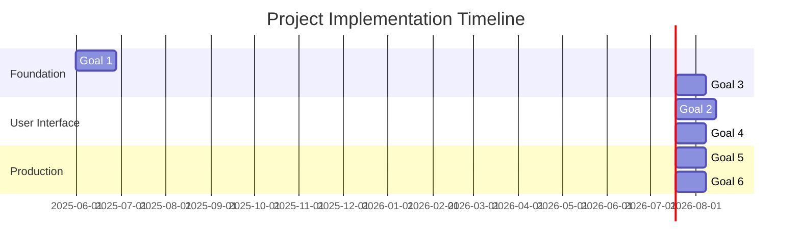

# Project Plan: On-Premises RAG Solution

## Executive Summary

**Objective**: Build an open-source, on-premises Retrieval-Augmented Generation (RAG) system that operates entirely offline. It ingests large document collections, supports interactive Q&A through a web GUI with RBAC, enables natural language database queries, and supports multiple local LLMs.

### Key Business Features

- **Document Knowledge Base**: Ingest and index documents for RAG
- **Interactive Q&A Interface**: Web GUI with role-based access control  
- **Multi-LLM Support**: Flexible, local model usage (Mistral, Phi-3, etc.)
- **Database Q&A**: Translate natural language to SQL over PostgreSQL/MSSQL
- **Offline Deployment**: No external calls, all local execution
- **Enterprise Security**: RBAC, application and network-level isolation

This plan has been reviewed to ensure that the initial focus is on
document-based question answering. Database NLP/SQL capabilities will only
begin once the document pipeline is validated and stable. At this stage the
repository contains planning artifacts only; source code will be added as tasks
in the `docs/project/team` folder are executed.

---

## Strategic Goals Overview

### Goal 1: Technical Foundation & Document Knowledge Base

**Business Impact**: Establish robust development foundation and core RAG capabilities

#### Core Features
- Document ingestion pipeline (PDF, DOCX, TXT, Markdown)
- Vector embedding and storage using ChromaDB
- LLM integration with Ollama
- Basic Q&A functionality

#### Technical Implementation

**Document Processing Pipeline**:

```python
from langchain.embeddings import HuggingFaceEmbeddings
from langchain.vectorstores import Chroma

# Embedding model setup
embeddings = HuggingFaceEmbeddings(
    model_name="sentence-transformers/all-MiniLM-L6-v2"
)

# Vector store configuration
vectordb = Chroma(
    collection_name="documents",
    embedding_function=embeddings,
    persist_directory="./data/vectordb"
)
```

**Timeline**: 3-4 weeks | **Priority**: Critical

### Goal 2: Interactive Q&A Interface with RBAC

**Business Impact**: Deliver enterprise-grade user interface and security

#### Core Features
- FastAPI backend with JWT authentication
- React frontend for modern UX
- Role-based document access control
- Admin panel for user management

#### Technical Implementation

**Authentication Flow**:

```python
from fastapi import FastAPI, Depends
from fastapi.security import HTTPBearer

app = FastAPI()
security = HTTPBearer()

@app.post("/query")
async def query_documents(
    query: str,
    token: str = Depends(security)
):
    # RBAC filtering in vector search
    user_roles = extract_roles_from_token(token)
    results = vectordb.similarity_search(
        query,
        filter={"roles": {"$in": user_roles}}
    )
    return {"answer": generate_answer(results), "sources": results}
```

**Timeline**: 3-4 weeks | **Priority**: Medium

### Goal 3: Modular LLM Integration

**Business Impact**: Ensure flexibility and future-proofing of AI capabilities

#### Core Features
- Configurable model backends (Ollama, llama.cpp, HuggingFace)
- Default Mistral 7B with Apache 2.0 license
- Custom prompt templates per model
- Performance benchmarking

#### Technical Implementation

**Model Provider Interface**:

```python
from abc import ABC, abstractmethod

class LLMProvider(ABC):
    @abstractmethod
    def generate_answer(self, prompt: str) -> str:
        pass

class OllamaProvider(LLMProvider):
    def __init__(self, model_name: str = "mistral:7b"):
        self.model = model_name
        
    def generate_answer(self, prompt: str) -> str:
        # Ollama API call
        response = ollama.chat(
            model=self.model,
            messages=[{"role": "user", "content": prompt}]
        )
        return response["message"]["content"]
```

**Timeline**: 2-3 weeks | **Priority**: High

### Goal 4: Natural Language to SQL (Database Q&A)

This goal begins only after Goals 1 and 2 verify that document question-answering
is stable. It introduces database NLP/SQL capabilities once the core RAG
workflow is proven.

**Business Impact**: Enable business users to query databases without SQL knowledge

#### Core Features
- PostgreSQL and MSSQL support
- Intent recognition for query routing
- Security controls (read-only access, query filtering)
- Results formatting and explanation

#### Technical Implementation

**NL2SQL Pipeline**:

```python
def nl_to_sql_pipeline(question: str, schema: str, user_roles: list) -> dict:
    # Generate SQL prompt
    prompt = f"""
    You are an expert data analyst. Convert this question to SQL.
    
    Database Schema:
    {schema}
    
    Question: {question}
    
    Generate only SELECT statements. No DELETE, DROP, or UPDATE allowed.
    
    SQL:
    """
    
    # Get SQL from LLM
    sql_query = llm_provider.generate_answer(prompt)
    
    # Execute with safety checks
    if validate_sql_safety(sql_query):
        results = execute_readonly_query(sql_query, user_roles)
        explanation = explain_results(results, question)
        return {
            "sql": sql_query,
            "results": results,
            "explanation": explanation
        }
    else:
        raise SecurityError("Unsafe SQL query detected")
```

**Timeline**: 2-3 weeks | **Priority**: Medium

### Goal 5: Deployment & Infrastructure

**Business Impact**: Enable production deployment with enterprise standards

#### Core Features
- Docker containerization
- Development tooling (uv, ruff, pytest)
- Performance monitoring
- CI/CD pipeline

#### Technical Implementation

**Docker Compose Configuration**:

```yaml
version: '3.8'
services:
  rag-backend:
    build: .
    ports:
      - "8000:8000"
    environment:
      - DATABASE_URL=${DATABASE_URL}
      - JWT_SECRET=${JWT_SECRET}
    volumes:
      - ./data:/app/data
    depends_on:
      - ollama
      - postgres

  ollama:
    image: ollama/ollama:latest
    ports:
      - "11434:11434"
    volumes:
      - ollama_data:/root/.ollama

  postgres:
    image: postgres:15
    environment:
      POSTGRES_DB: ragdb
      POSTGRES_USER: ${DB_USER}
      POSTGRES_PASSWORD: ${DB_PASSWORD}
    volumes:
      - postgres_data:/var/lib/postgresql/data

volumes:
  ollama_data:
  postgres_data:
```

**Timeline**: 2-3 weeks | **Priority**: Medium

### Goal 6: Security & Privacy

**Business Impact**: Meet enterprise security and compliance requirements

#### Core Features
- Network isolation and HTTPS
- Secrets management
- RBAC enforcement
- Audit logging
- Privacy controls

#### Technical Implementation

**Security Configuration**:

```python
from fastapi.middleware.cors import CORSMiddleware
from fastapi.middleware.trustedhost import TrustedHostMiddleware

# Security middleware
app.add_middleware(
    TrustedHostMiddleware, 
    allowed_hosts=["localhost", "*.yourcompany.com"]
)

app.add_middleware(
    CORSMiddleware,
    allow_origins=["https://yourcompany.com"],
    allow_credentials=True,
    allow_methods=["GET", "POST"],
    allow_headers=["*"],
)

# RBAC enforcement
def enforce_rbac(required_roles: list):
    def decorator(func):
        async def wrapper(*args, **kwargs):
            token = kwargs.get('token')
            user_roles = extract_roles_from_token(token)
            if not any(role in user_roles for role in required_roles):
                raise HTTPException(403, "Insufficient permissions")
            return await func(*args, **kwargs)
        return wrapper
    return decorator
```

**Timeline**: 2-3 weeks | **Priority**: High

---

## Implementation Timeline



## Technology Stack Summary

| Layer | Technology | License | Rationale |
|-------|------------|---------|-----------|
| **Language** | Python 3.11+ | PSF | Mature ML/AI ecosystem |
| **Framework** | FastAPI + React | MIT + MIT | Modern, high-performance stack |
| **Database** | PostgreSQL + ChromaDB | PostgreSQL + Apache 2.0 | Enterprise reliability |
| **LLM** | Ollama + Mistral 7B | MIT + Apache 2.0 | Local inference, commercial use |
| **Deployment** | Docker + Nginx | Apache 2.0 + BSD | Industry standard |
| **Development** | uv + ruff + pytest | MIT + MIT + MIT | Modern, fast tooling |

## Success Metrics

### Technical Metrics
- Document processing: <10 seconds per file
- Query response time: <3 seconds average
- Concurrent users: 10+ supported
- Uptime: 99.9% availability target

### Business Metrics
- User adoption: 80% of target users active monthly
- Query accuracy: 85%+ user satisfaction
- Support overhead: <5 tickets per week
- Deployment time: <2 hours on new environment

## Risk Management

| Risk | Probability | Impact | Mitigation |
|------|-------------|--------|------------|
| **LLM Performance** | Medium | High | Benchmark multiple models, fallback options |
| **Scalability Issues** | Medium | Medium | Load testing, horizontal scaling design |
| **Security Vulnerabilities** | Low | High | Security reviews, penetration testing |
| **License Compliance** | Low | High | Legal review, open-source alternatives |

## Documentation Deliverables

### User Documentation
- **Quick Start Guide**: 15-minute setup and first query
- **User Manual**: Complete feature documentation with screenshots
- **Admin Guide**: User management, system configuration
- **Troubleshooting Guide**: Common issues and solutions

### Technical Documentation
- **API Reference**: Complete endpoint documentation
- **Architecture Guide**: System design and component interaction
- **Deployment Guide**: Docker and manual installation
- **Security Guide**: Best practices and compliance

---

## Next Steps

1. **Immediate**: Begin Goal 1 implementation - Technical Foundation
2. **Week 2**: Start parallel development of documentation structure
3. **Week 4**: Begin user testing with MVP
4. **Week 8**: Production deployment preparation
5. **Week 12**: Go-live with full feature set

**Maintained By**: Technical Team  
**Review Cycle**: Weekly during development, monthly in maintenance  
**Last Updated**: December 2024 