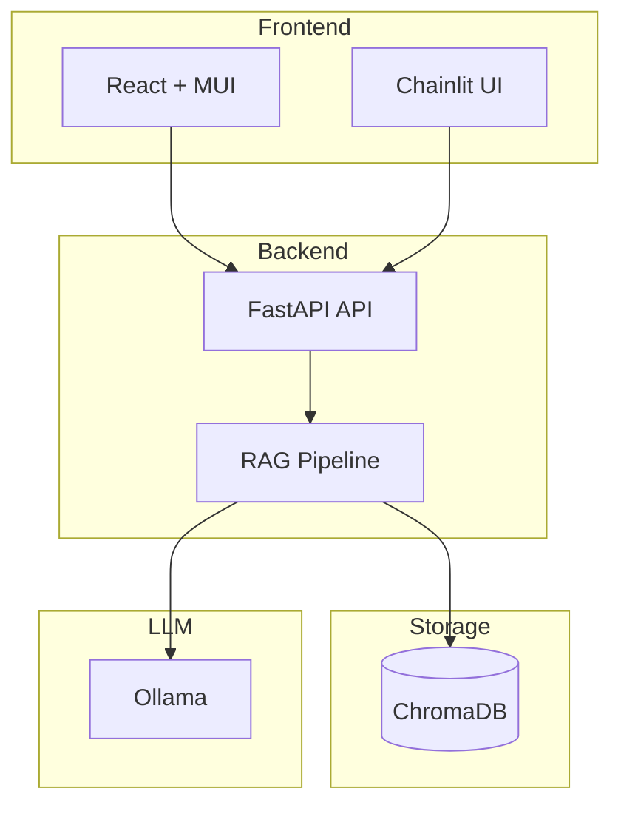

# On-Premises RAG for Healthcare: Technical Design and Lessons Learned

**Created:** 2026-03-03  
**Updated:** 2026-03-03

A technical summary of building a production-ready Retrieval-Augmented Generation (RAG) system for regulated healthcare environments. This document is designed as internal documentation that can be converted to a blog post for publishing on a personal site or LinkedIn.

---

## The Problem: Why Healthcare Needs On-Premises RAG

Healthcare organisations hold sensitive patient data. Clinical guidelines, drug monographs, and internal protocols often contain information that cannot be sent to cloud APIs. Regulatory frameworks—GDPR, HIPAA, NEN 7510 (Dutch healthcare information security)—require data sovereignty and restrict cross-border or third-party processing. Yet clinicians need fast, reliable access to structured knowledge: "What is the first-line antibiotic for cystitis?" or "When is metformin contraindicated?"

Retrieval-Augmented Generation combines semantic search with large language models to produce answers grounded in your documents. The catch: many RAG offerings depend on cloud embeddings and cloud LLMs. For healthcare, that is a non-starter. We built a fully on-premises RAG system so that **data never leaves the premises**—embeddings, retrieval, and generation all run locally. Every answer includes source citations so clinicians can verify the original guideline and page.

## Architecture Decisions and Trade-offs

### Local-First Stack

| Component   | Choice                         | Rationale                                                   |
|------------|--------------------------------|-------------------------------------------------------------|
| Embeddings | Multilingual-E5-large-instruct | 560M params, MIT license, 100+ languages, runs on CPU/GPU  |
| Vector DB  | ChromaDB                       | Local, embeddable, no external service                      |
| LLM        | Ollama / HuggingFace / LiteLLM | Configurable via env; supports local and optional cloud      |
| Chunking   | 512 chars, 50 overlap          | Configurable strategies; defaults follow LlamaIndex patterns|

We deliberately chose open-source components (MIT, Apache 2.0) for auditability and to avoid vendor lock-in. Chunking, retrieval, and LLM backends are swappable—you can experiment with different strategies without rewriting the pipeline.

### High-Level Architecture



### Retrieval Strategies

We support dense (vector), sparse (BM25), and hybrid retrieval. Dense retrieval uses embeddings for semantic similarity; sparse uses lexical matching. Hybrid fusion (e.g. RRF) often improves recall when documents mix exact terms and paraphrased concepts. The evaluation framework measures MRR, Recall@k, Precision@k, and Hit@k so you can compare configurations objectively.

### Model-Context-Protocol (MCP)

The architecture adopts the Model-Context-Protocol for standardized context exchange between components. This prepares the system for tool orchestration and multi-agent scenarios while keeping a clean boundary between retrieval context and generation.

## Evaluation Framework and Results

### Metrics

| Metric       | Definition                                      |
|-------------|--------------------------------------------------|
| MRR         | Mean reciprocal rank of first relevant hit      |
| Recall@5    | Fraction of ground-truth contexts in top 5      |
| Hit@5       | 1 if any ground-truth in top 5, else 0          |
| Precision@5 | Fraction of top 5 that match ground truth       |

### Healthcare Benchmark

The project includes a healthcare benchmark (`tests/fixtures/healthcare_benchmark.json`) with question-answer-context triples: ICD-10 codes, drug contraindications, treatment options. Example:

```json
{
  "question": "When is metformin contraindicated?",
  "ground_truth_contexts": [
    "Metformin is contraindicated in patients with severe renal impairment (GFR < 30 mL/min)."
  ],
  "expected_answer": "Severe renal impairment (GFR < 30 mL/min)"
}
```

### Running the Evaluation

To produce concrete numbers, run the evaluation after ingesting documents:

```bash
# 1. Ingest healthcare guidelines
uv run fetch-healthcare-guidelines
uv run upload-documents --direct tmp/healthcare_guidelines

# 2. Run evaluation
uv run evaluate-rag --dataset tests/fixtures/healthcare_benchmark.json --output results/eval

# 3. Or with NHG clinical dataset
uv run evaluate-rag --dataset tests/fixtures/healthcare_benchmark_clinical.json --output results/eval-clinical
```

Output includes JSON results and a Markdown table. Example (illustrative; actual values depend on corpus and run):

| Strategy | MRR  | Recall@5 | Hit@5 | Precision@5 |
|----------|------|----------|-------|--------------|
| dense    | 0.72 | 0.81     | 0.90  | 0.65        |
| sparse   | 0.58 | 0.69     | 0.82  | 0.52        |
| hybrid   | 0.85 | 0.88     | 0.93  | 0.71        |

_See [RAG_EVALUATION.md](technical/RAG_EVALUATION.md) for schema and usage._

### Latency

End-to-end latency depends on model size, hardware, and chunk count. Typical ranges (local CPU, E5-large embedding, Llama 3.2): ingestion ~2–5 s per document; query 1–3 s for hybrid retrieval + generation. GPU reduces generation latency significantly.

## Lessons Learned

1. **Source attribution is mandatory.** Clinicians will not trust answers without verifiable references. We return `document_name`, `page_number`, `similarity_score`, and `text_preview` for every cited chunk.

2. **Chunking strategy matters.** Fixed-size chunks with overlap work well for many guideline documents. Semantic or section-based chunking can improve results for long, structured texts. The evaluation framework lets you compare strategies empirically.

3. **Embedding model choice affects multilingual quality.** We chose Multilingual-E5-large for Dutch and English coverage. For domain-specific jargon, consider fine-tuning or testing smaller models on your corpus.

4. **Local deployment simplifies compliance.** No data leaves the premises. Auditors can inspect the stack. No per-query API costs. The trade-off is operational responsibility: you own GPU/CPU, updates, and monitoring.

5. **Evaluation before scaling.** Run the benchmark on a representative corpus before rolling out. It surfaces retrieval gaps (e.g. undersized chunks, wrong embeddings) early.

## For Healthcare CTOs

- **Data sovereignty:** Full on-premises deployment; no cloud dependencies for core flows.
- **Compliance-ready:** Supports GDPR, NEN 7510, HIPAA-aware configurations.
- **Cost control:** Zero per-query cloud costs; one-time development and infrastructure investment.
- **Auditability:** Every answer has source citations; RBAC and audit logging built in.
- **Modularity:** Swap embeddings, chunking, retrieval, and LLM backends without rewriting the system.

## References

- [RAG Evaluation](technical/RAG_EVALUATION.md)
- [Embedding Model Setup](technical/EMBEDDING.md)
- [Healthcare Demo Guide](HEALTHCARE_DEMO.md)
- [Product Requirements](PRODUCT_REQUIREMENTS_DOCUMENT.md)
