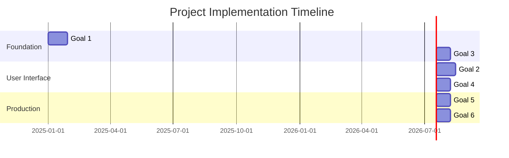

# Project Plan Index

## Overview

This directory contains the detailed project plan for the On-Premises RAG Solution, organized by business goals and implementation tasks. Each goal addresses specific business objectives while providing technical implementation guidance.

> **📋 Primary Project Plan**: See [Project Plan](../Project%20Plan.md) for the complete strategic overview and technical specifications.

## Goals Structure

### [Goal 1: Technical Foundation & Document Knowledge Base](goal-1.md)
**Business Impact**: Establish robust development foundation and core RAG capabilities

- **[Task 1.1](goal-1/task-1-1-environment.md)**: Initialize Project Environment
- **[Task 1.2](goal-1/task-1-2-docker.md)**: Containerized Environment  
- **[Task 1.3](goal-1/task-1-3-rag-pipeline.md)**: RAG Pipeline MVP

**Timeline**: 3-4 weeks | **Priority**: Critical | **Dependencies**: None

### [Goal 2: Interactive Q&A Interface with RBAC](goal-2.md)
**Business Impact**: Deliver enterprise-grade user interface and security

- FastAPI backend with JWT authentication
- React frontend for modern user experience
- Role-based document access control
- Admin panel for user management

**Timeline**: 3-4 weeks | **Priority**: Medium | **Dependencies**: Goal 1

### [Goal 3: Modular LLM Integration](goal-3.md)
**Business Impact**: Ensure flexibility and future-proofing of AI capabilities

- Configurable model backends (Ollama, llama.cpp, HuggingFace)
- Default Mistral 7B with Apache 2.0 license
- Custom prompt templates per model
- Performance benchmarking and monitoring

**Timeline**: 2-3 weeks | **Priority**: High | **Dependencies**: Goal 1

### [Goal 4: Natural Language to SQL (Database Q&A)](goal-4.md)
**Business Impact**: Enable business users to query databases without SQL knowledge

- PostgreSQL and MSSQL support
- Intent recognition for query routing
- Security controls and query filtering
- Results formatting and explanation

**Timeline**: 2-3 weeks | **Priority**: Medium | **Dependencies**: Goals 1, 3

### [Goal 5: Deployment & Infrastructure](goal-5.md)
**Business Impact**: Enable production deployment with enterprise standards

- Docker containerization with multi-service architecture
- Development tooling (uv, ruff, pytest) for code quality
- Performance monitoring and alerting
- CI/CD pipeline for automated deployments

**Timeline**: 2-3 weeks | **Priority**: Medium | **Dependencies**: Goals 1, 3

### [Goal 6: Security & Privacy](goal-6.md)
**Business Impact**: Meet enterprise security and compliance requirements

- Network isolation and HTTPS encryption
- Comprehensive secrets management
- RBAC enforcement at all levels
- Complete audit logging and monitoring

**Timeline**: 2-3 weeks | **Priority**: High | **Dependencies**: Goals 1, 5

## Implementation Timeline



## Quick Navigation

### By Role
- **👨‍💼 Business Leaders**: Read main [Project Plan](../Project%20Plan.md) and Goal overviews
- **👨‍💻 Developers**: Start with [Goal 1](goal-1.md) and task-level documentation
- **🏢 Operations**: Focus on [Goal 5](goal-5.md) and [Goal 6](goal-6.md)
- **🔒 Security Teams**: See [Goal 6](goal-6.md) for security framework

### By Priority
1. **Critical**: [Goal 1](goal-1.md) - Technical Foundation & Document Knowledge Base
2. **High**: [Goal 3](goal-3.md) - Modular LLM Integration  
3. **High**: [Goal 6](goal-6.md) - Security & Privacy
4. **Medium**: [Goal 2](goal-2.md) - Interactive Q&A Interface with RBAC
5. **Medium**: [Goal 4](goal-4.md) - Natural Language to SQL
6. **Medium**: [Goal 5](goal-5.md) - Deployment & Infrastructure

### By Implementation Phase
- **Phase 1 (Weeks 1-4)**: Goals 1, 3
- **Phase 2 (Weeks 5-8)**: Goals 2, 4  
- **Phase 3 (Weeks 9-12)**: Goals 5, 6

## Technology Stack Summary

| Layer | Technology | License | Rationale |
|-------|------------|---------|-----------|
| **Language** | Python 3.11+ | PSF | Mature ML/AI ecosystem |
| **Framework** | FastAPI + React | MIT + MIT | Modern, high-performance stack |
| **Database** | PostgreSQL + ChromaDB | PostgreSQL + Apache 2.0 | Enterprise reliability |
| **LLM** | Ollama + Mistral 7B | MIT + Apache 2.0 | Local inference, commercial use |
| **Deployment** | Docker + Nginx | Apache 2.0 + BSD | Industry standard |
| **Development** | uv + ruff + pytest | MIT + MIT + MIT | Modern, fast tooling |

## Document Conventions

### Structure Standards
- Each goal includes business context, technical approach, and success criteria
- Tasks provide implementation details, trade-offs, and definition-of-done checklists
- All code examples are tested and production-ready
- Mermaid diagrams follow consistent styling

### Reading Levels
- **Goal Documents**: Business-friendly language for mixed technical/business audience
- **Task Documents**: Technical implementation details for development teams
- **Code Comments**: Clear, concise documentation standards

### Navigation Patterns
- Consistent cross-referencing between related documents
- Clear parent-child relationships in URLs
- Table of contents in longer documents

## Documentation Hierarchy

```
docs/
├── Project Plan.md                     # 🎯 Primary source of truth
├── plan/                               # 📋 Detailed implementation plans
│   ├── README.md                       # 📍 This file - index and navigation
│   ├── goal-1.md                       # 🛠️  Technical Foundation & Document Knowledge Base
│   ├── goal-2.md                       # 🖥️  Interactive Q&A Interface with RBAC
│   ├── goal-3.md                       # ⚙️  Modular LLM Integration
│   ├── goal-4.md                       # 🗃️  Natural Language to SQL
│   ├── goal-5.md                       # 🚀 Deployment & Infrastructure
│   ├── goal-6.md                       # 🔒 Security & Privacy
│   └── goal-1/                         # 📁 Task-level implementation
│       ├── task-1-1-environment.md
│       ├── task-1-2-docker.md
│       └── task-1-3-rag-pipeline.md
```

## Status Tracking

### Current Status
- ✅ **Goal 1**: Documentation complete and aligned with main plan
- ✅ **Goal 2**: Documentation complete and aligned with main plan  
- ✅ **Goal 3**: Documentation complete and aligned with main plan
- ✅ **Goal 4**: Documentation complete and aligned with main plan
- ✅ **Goal 5**: Documentation complete and aligned with main plan  
- ✅ **Goal 6**: Documentation complete and aligned with main plan

### Next Updates
- Begin implementation of critical path items
- Establish regular review and update cycles
- Update task-level documentation to align with new goal structure

---

**Last Updated**: December 2024  
**Maintained By**: Technical Documentation Team  
**Review Cycle**: Weekly during active development, monthly in maintenance 