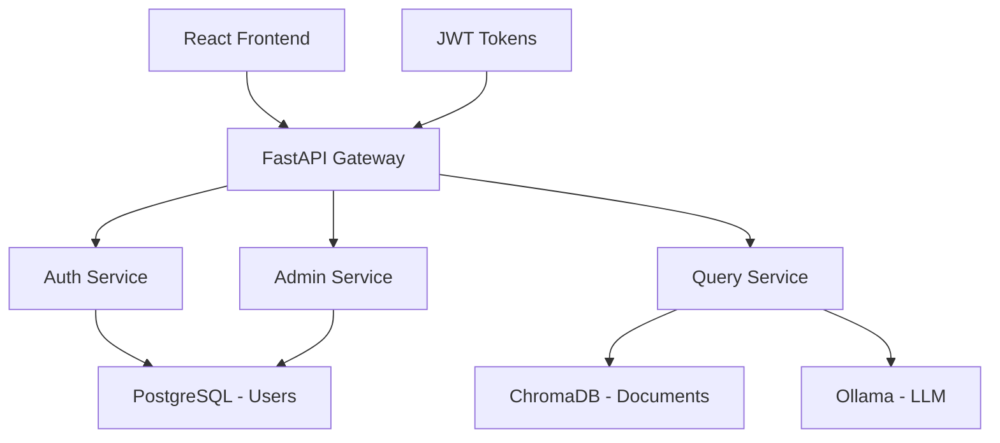

# Goal 2: Interactive Q&A Interface with RBAC

## Context from Business Objective

This goal delivers the user-facing interface that enables business users to interact with the document knowledge base through natural language queries. The interface must provide enterprise-grade security through role-based access control (RBAC) while maintaining an intuitive user experience.

## Objective

Create a modern web application with FastAPI backend and React frontend that enables users to query documents through natural language, with comprehensive role-based access control ensuring users only see documents they're authorized to access.

## Core Features

- FastAPI backend with JWT authentication
- React frontend for modern user experience
- Role-based document access control
- Admin panel for user management
- Query history and source attribution
- Real-time query processing

## Business Impact

**Deliver enterprise-grade user interface and security**

### Immediate Value
- **Self-Service Analytics**: Business users can find information without IT support
- **Secure Access**: Granular control over document visibility by role
- **Audit Trail**: Complete logging of user queries and access patterns

### Enterprise Benefits
- **Compliance Ready**: RBAC supports regulatory requirements
- **Scalable User Management**: Admin tools for user lifecycle management
- **Modern UX**: Intuitive interface drives user adoption

## Technical Implementation

### Authentication Flow

**Core Components**:

```python
from fastapi import FastAPI, Depends
from fastapi.security import HTTPBearer

app = FastAPI()
security = HTTPBearer()

@app.post("/query")
async def query_documents(
    query: str,
    token: str = Depends(security)
):
    # RBAC filtering in vector search
    user_roles = extract_roles_from_token(token)
    results = vectordb.similarity_search(
        query,
        filter={"roles": {"$in": user_roles}}
    )
    return {"answer": generate_answer(results), "sources": results}
```

### Technology Stack

| Component | Technology | Purpose | Rationale |
|-----------|------------|---------|-----------|
| **Backend** | FastAPI | API server | High performance, async support, excellent docs |
| **Frontend** | React + TypeScript | User interface | Modern, component-based, strong typing |
| **Authentication** | JWT + OAuth2 | User auth | Stateless, secure, industry standard |
| **Database** | PostgreSQL | User/role storage | ACID compliance, mature, enterprise-ready |
| **UI Library** | Material-UI | Component library | Professional look, accessibility built-in |

## Architecture Overview



## User Interface Design

### End User Interface
- **Query Box**: Natural language input with suggestions
- **Results Display**: Formatted answers with source attribution
- **History Panel**: Previous queries and results
- **Document Preview**: Inline preview of source documents
- **Export Options**: Save results as PDF or share links

### Admin Interface
- **User Management**: Create, edit, disable user accounts
- **Role Assignment**: Assign document access roles to users
- **Document Management**: View indexed documents, manage permissions
- **System Monitoring**: Query performance, user activity analytics
- **Audit Logs**: Complete access and query history

## Role-Based Access Control (RBAC)

### Role Hierarchy
```
Super Admin
├── Department Admin (Finance, HR, Legal, etc.)
│   ├── Department Manager
│   │   ├── Senior Staff
│   │   └── Junior Staff
│   └── Contractor (Limited Access)
└── Guest (Read-only, Public Documents)
```

### Permission Model
- **Document-Level**: Each document tagged with required roles
- **Query-Level**: Filter vector search results by user roles
- **Feature-Level**: Admin functions restricted to admin roles
- **Audit-Level**: All access logged for compliance

## Implementation Tasks

### Task 2.1: Backend API Development
- JWT authentication implementation
- User management APIs
- Query processing with RBAC filtering
- Admin panel APIs

### Task 2.2: Frontend Development
- React application with TypeScript
- User authentication flows
- Query interface with real-time results
- Admin dashboard

### Task 2.3: RBAC Implementation
- Role definition and management
- Document permission tagging
- Query filtering by user roles
- Audit logging system

### Task 2.4: Integration Testing
- End-to-end user flows
- Security testing
- Performance testing
- User acceptance testing

## Security Considerations

### Authentication Security
- **JWT Expiration**: Short-lived tokens with refresh mechanism
- **Password Policy**: Strong password requirements
- **MFA Support**: Optional multi-factor authentication
- **Session Management**: Secure session handling

### Authorization Security
- **Principle of Least Privilege**: Users see only authorized documents
- **Role Validation**: Server-side role checking on every request
- **SQL Injection Prevention**: Parameterized queries only
- **CSRF Protection**: Built-in FastAPI protections

### Data Security
- **Encryption in Transit**: HTTPS for all communications
- **Input Validation**: Sanitize all user inputs
- **Error Handling**: No sensitive data in error messages
- **Audit Logging**: Complete access trail for compliance

## Performance Requirements

### Response Time Targets
- **Login**: < 2 seconds
- **Query Processing**: < 3 seconds average
- **Document Loading**: < 1 second for previews
- **Admin Operations**: < 5 seconds

### Scalability Targets
- **Concurrent Users**: 50+ simultaneous users
- **Query Throughput**: 100+ queries per minute
- **Document Volume**: 100K+ documents with role filtering
- **User Base**: 1000+ users with role hierarchy

## Success Criteria

### Functional Requirements
- [ ] Users can authenticate and access appropriate documents
- [ ] Natural language queries return relevant, authorized results
- [ ] Admin panel enables complete user and role management
- [ ] Role-based filtering prevents unauthorized document access
- [ ] Query history and audit logs function correctly

### Non-Functional Requirements
- [ ] Response times meet performance targets
- [ ] Interface is intuitive for non-technical users
- [ ] Security penetration testing passes
- [ ] RBAC system prevents privilege escalation
- [ ] System handles concurrent user load

### User Experience Requirements
- [ ] 90% of users complete tasks without training
- [ ] Query accuracy meets 85%+ satisfaction rating
- [ ] Admin workflows reduce user management time by 70%
- [ ] Interface works on desktop and tablet devices

## Risk Mitigation

| Risk | Impact | Mitigation |
|------|--------|------------|
| **Authentication Bypass** | Critical | Multiple security layers, penetration testing |
| **Role Escalation** | High | Server-side validation, audit logging |
| **Poor User Adoption** | Medium | User testing, iterative design improvements |
| **Performance Issues** | Medium | Load testing, query optimization, caching |

## Timeline & Priority

**Timeline**: 3-4 weeks | **Priority**: Medium | **Dependencies**: Goal 1

### Week 1: Backend Foundation
- FastAPI application structure
- JWT authentication system
- User management APIs

### Week 2: Frontend Development  
- React application setup
- Authentication flows
- Basic query interface

### Week 3: RBAC Implementation
- Role-based filtering
- Admin panel development
- Security hardening

### Week 4: Testing & Polish
- Integration testing
- User acceptance testing
- Performance optimization

## Next Steps

Upon completion of Goal 2:
1. Proceed to [Goal 3: Modular LLM Integration](goal-3.md)
2. Begin user training and onboarding
3. Establish user feedback collection system

## Related Documentation

- [Goal 1: Technical Foundation](goal-1.md)
- [Goal 3: Modular LLM Integration](goal-3.md)
- [Security Requirements](goal-6.md) 