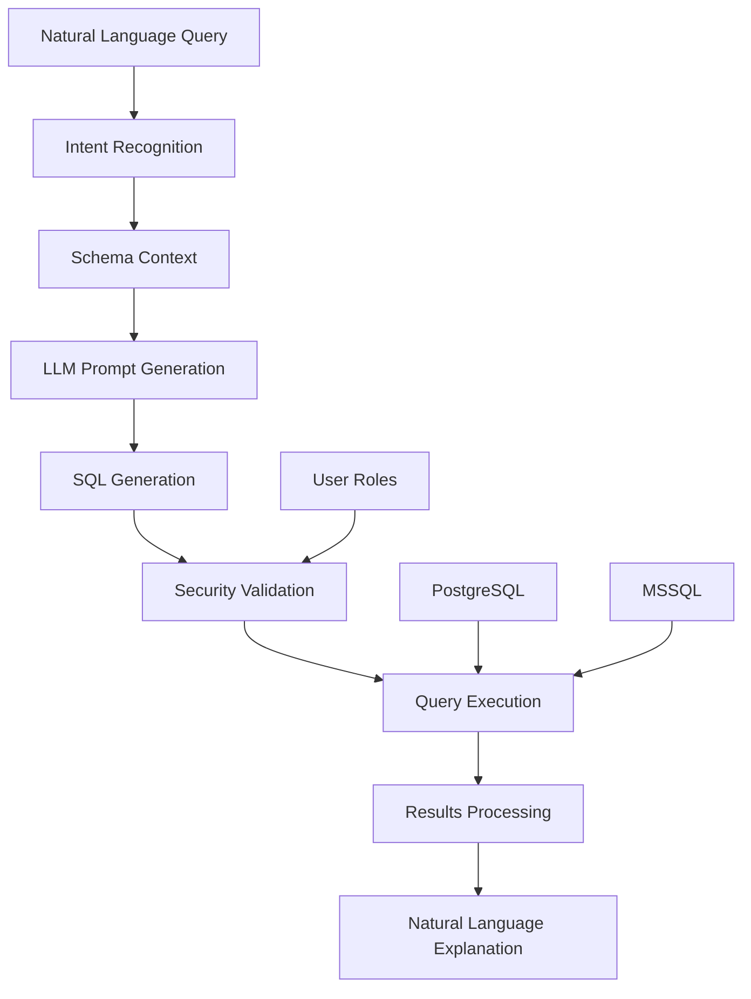

# Goal 4: Natural Language to SQL (Database Q&A)

## Context from Business Objective

This goal enables business users to query databases using natural language without requiring SQL knowledge. The system must translate natural language questions into safe, accurate SQL queries while maintaining enterprise security and providing clear explanations of results.

## Objective

Build a natural language to SQL system that supports PostgreSQL and MSSQL databases, with intent recognition for query routing, comprehensive security controls, and intelligent results formatting. This empowers business users to access database insights directly.

## Core Features

- PostgreSQL and MSSQL support
- Intent recognition for query routing  
- Security controls (read-only access, query filtering)
- Results formatting and explanation
- Natural language result interpretation
- Query history and optimization

## Business Impact

**Enable business users to query databases without SQL knowledge**

### Immediate Value
- **Self-Service Analytics**: Business users access data without IT support
- **Faster Insights**: Reduce time from question to answer from hours to minutes
- **Democratized Data**: Make database insights accessible to non-technical users

### Strategic Benefits
- **Data-Driven Decisions**: Enable more stakeholders to use data effectively
- **Reduced IT Burden**: Decrease dependency on database specialists
- **Compliance Ready**: Built-in access controls and audit trails

## Technical Implementation

### NL2SQL Pipeline

**Core Architecture**:

```python
def nl_to_sql_pipeline(question: str, schema: str, user_roles: list) -> dict:
    # Generate SQL prompt
    prompt = f"""
    You are an expert data analyst. Convert this question to SQL.
    
    Database Schema:
    {schema}
    
    Question: {question}
    
    Generate only SELECT statements. No DELETE, DROP, or UPDATE allowed.
    
    SQL:
    """
    
    # Get SQL from LLM
    sql_query = llm_provider.generate_answer(prompt)
    
    # Execute with safety checks
    if validate_sql_safety(sql_query):
        results = execute_readonly_query(sql_query, user_roles)
        explanation = explain_results(results, question)
        return {
            "sql": sql_query,
            "results": results,
            "explanation": explanation
        }
    else:
        raise SecurityError("Unsafe SQL query detected")
```

### Database Architecture



## Database Support

### PostgreSQL Integration

**Connection Management**:

```python
import psycopg2
from psycopg2 import pool

class PostgreSQLConnector:
    def __init__(self, config: dict):
        self.config = config
        self.connection_pool = psycopg2.pool.ThreadedConnectionPool(
            minconn=1,
            maxconn=20,
            host=config['host'],
            database=config['database'],
            user=config['readonly_user'],
            password=config['password']
        )
    
    def execute_query(self, sql: str, user_roles: list) -> list:
        """Execute read-only query with role-based filtering."""
        
        # Add role-based WHERE clauses
        filtered_sql = self._apply_role_filters(sql, user_roles)
        
        conn = self.connection_pool.getconn()
        try:
            with conn.cursor() as cursor:
                cursor.execute(filtered_sql)
                results = cursor.fetchall()
                columns = [desc[0] for desc in cursor.description]
                
            return {
                'columns': columns,
                'rows': results,
                'row_count': len(results)
            }
        finally:
            self.connection_pool.putconn(conn)
```

### MSSQL Integration

**Connection Management**:

```python
import pyodbc

class MSSQLConnector:
    def __init__(self, config: dict):
        self.config = config
        self.connection_string = (
            f"DRIVER={{ODBC Driver 17 for SQL Server}};"
            f"SERVER={config['server']};"
            f"DATABASE={config['database']};"
            f"UID={config['readonly_user']};"
            f"PWD={config['password']}"
        )
    
    def execute_query(self, sql: str, user_roles: list) -> dict:
        """Execute read-only query with role-based filtering."""
        
        filtered_sql = self._apply_role_filters(sql, user_roles)
        
        with pyodbc.connect(self.connection_string) as conn:
            cursor = conn.cursor()
            cursor.execute(filtered_sql)
            
            columns = [column[0] for column in cursor.description]
            rows = cursor.fetchall()
            
            return {
                'columns': columns,
                'rows': [list(row) for row in rows],
                'row_count': len(rows)
            }
```

## Intent Recognition System

### Query Classification

```python
class QueryClassifier:
    """Classifies natural language queries by intent."""
    
    def __init__(self):
        self.intent_patterns = {
            'aggregation': [
                'total', 'sum', 'average', 'count', 'maximum', 'minimum',
                'how many', 'how much', 'total number'
            ],
            'filtering': [
                'where', 'with', 'having', 'that have', 'filter by',
                'show me', 'find', 'search for'
            ],
            'comparison': [
                'compare', 'versus', 'vs', 'difference between',
                'which is', 'better', 'higher', 'lower'
            ],
            'trend_analysis': [
                'over time', 'trend', 'change', 'growth', 'decline',
                'monthly', 'yearly', 'quarterly'
            ]
        }
    
    def classify_query(self, question: str) -> dict:
        """Classify query intent and extract entities."""
        
        question_lower = question.lower()
        intents = []
        
        for intent, patterns in self.intent_patterns.items():
            if any(pattern in question_lower for pattern in patterns):
                intents.append(intent)
        
        return {
            'intents': intents,
            'complexity': self._assess_complexity(question),
            'entities': self._extract_entities(question)
        }
```

### Schema Context Management

```python
class SchemaContextManager:
    """Manages database schema context for query generation."""
    
    def __init__(self, db_connector):
        self.db_connector = db_connector
        self.schema_cache = {}
    
    def get_relevant_schema(self, question: str, user_roles: list) -> str:
        """Get schema context relevant to the question."""
        
        # Extract table/column mentions
        entities = self._extract_database_entities(question)
        
        # Get accessible tables for user roles
        accessible_tables = self._get_accessible_tables(user_roles)
        
        # Build focused schema context
        relevant_tables = self._match_entities_to_tables(
            entities, accessible_tables
        )
        
        return self._build_schema_context(relevant_tables)
    
    def _build_schema_context(self, tables: list) -> str:
        """Build concise schema description for LLM."""
        
        schema_parts = []
        for table in tables:
            columns = self._get_table_columns(table)
            relationships = self._get_table_relationships(table)
            
            schema_parts.append(f"""
            Table: {table}
            Columns: {', '.join(columns)}
            Relationships: {relationships}
            """)
        
        return '\n'.join(schema_parts)
```

## Security Framework

### SQL Safety Validation

```python
import sqlparse
from sqlparse.sql import IdentifierList, Identifier, Function
from sqlparse.tokens import Keyword, DML

class SQLSecurityValidator:
    """Validates SQL queries for security compliance."""
    
    def __init__(self):
        self.forbidden_keywords = {
            'DELETE', 'UPDATE', 'INSERT', 'DROP', 'CREATE', 'ALTER',
            'TRUNCATE', 'MERGE', 'GRANT', 'REVOKE', 'EXEC', 'EXECUTE'
        }
        
        self.forbidden_functions = {
            'xp_cmdshell', 'sp_configure', 'openrowset', 'opendatasource'
        }
    
    def validate_query(self, sql: str) -> tuple[bool, str]:
        """Validate SQL query for security compliance."""
        
        try:
            parsed = sqlparse.parse(sql)[0]
            
            # Check for forbidden keywords
            if self._contains_forbidden_keywords(parsed):
                return False, "Query contains forbidden operations"
            
            # Check for forbidden functions
            if self._contains_forbidden_functions(parsed):
                return False, "Query contains forbidden functions"
            
            # Validate only SELECT statements
            if not self._is_select_only(parsed):
                return False, "Only SELECT statements are allowed"
            
            # Check for SQL injection patterns
            if self._contains_injection_patterns(sql):
                return False, "Query contains potential injection patterns"
            
            return True, "Query is safe"
            
        except Exception as e:
            return False, f"Query parsing error: {str(e)}"
    
    def _contains_forbidden_keywords(self, parsed) -> bool:
        """Check for forbidden SQL keywords."""
        for token in parsed.flatten():
            if token.ttype is Keyword and token.value.upper() in self.forbidden_keywords:
                return True
        return False
```

### Role-Based Access Control

```python
class DatabaseRBAC:
    """Manages role-based access control for database queries."""
    
    def __init__(self, config: dict):
        self.role_mappings = config['role_mappings']
        self.table_permissions = config['table_permissions']
    
    def apply_role_filters(self, sql: str, user_roles: list) -> str:
        """Apply role-based filtering to SQL query."""
        
        # Parse SQL to identify tables
        tables = self._extract_tables_from_sql(sql)
        
        # Add WHERE clauses based on user roles
        filtered_sql = sql
        for table in tables:
            role_filter = self._get_role_filter(table, user_roles)
            if role_filter:
                filtered_sql = self._add_where_clause(filtered_sql, table, role_filter)
        
        return filtered_sql
    
    def _get_role_filter(self, table: str, user_roles: list) -> str:
        """Get role-based filter for a specific table."""
        
        for role in user_roles:
            if role in self.table_permissions.get(table, {}):
                return self.table_permissions[table][role]
        
        return None
```

## Results Processing

### Data Formatting

```python
class ResultsProcessor:
    """Processes and formats query results for display."""
    
    def format_results(self, results: dict, question: str) -> dict:
        """Format query results with appropriate visualizations."""
        
        formatted_results = {
            'summary': self._generate_summary(results, question),
            'table': self._format_table(results),
            'charts': self._suggest_charts(results),
            'insights': self._extract_insights(results, question)
        }
        
        return formatted_results
    
    def _format_table(self, results: dict) -> dict:
        """Format results as a clean table."""
        
        # Handle different data types
        formatted_rows = []
        for row in results['rows']:
            formatted_row = []
            for i, value in enumerate(row):
                formatted_value = self._format_value(value, results['columns'][i])
                formatted_row.append(formatted_value)
            formatted_rows.append(formatted_row)
        
        return {
            'columns': results['columns'],
            'rows': formatted_rows,
            'total_rows': results['row_count']
        }
    
    def _format_value(self, value, column_name: str):
        """Format individual values based on data type."""
        
        if isinstance(value, (int, float)):
            # Format numbers with appropriate precision
            if 'amount' in column_name.lower() or 'price' in column_name.lower():
                return f"${value:,.2f}"
            elif isinstance(value, float):
                return f"{value:.2f}"
            else:
                return f"{value:,}"
        
        elif isinstance(value, str) and len(value) > 50:
            # Truncate long strings
            return value[:47] + "..."
        
        return value
```

### Natural Language Explanation

```python
class ResultsExplainer:
    """Generates natural language explanations of query results."""
    
    def explain_results(self, results: dict, question: str, sql: str) -> str:
        """Generate natural language explanation of results."""
        
        explanation_prompt = f"""
        Question: {question}
        SQL Query: {sql}
        Results: {results['row_count']} rows returned
        
        Explain these results in simple business language:
        1. What the data shows
        2. Key insights or patterns
        3. Any limitations or caveats
        
        Keep the explanation under 100 words and business-friendly.
        """
        
        explanation = self.llm_provider.generate_answer(explanation_prompt)
        
        return explanation
```

## Performance Optimization

### Query Optimization

```python
class QueryOptimizer:
    """Optimizes generated SQL queries for performance."""
    
    def optimize_query(self, sql: str, schema_info: dict) -> str:
        """Optimize SQL query for better performance."""
        
        # Add appropriate indexes hints
        optimized_sql = self._add_index_hints(sql, schema_info)
        
        # Limit result set if no explicit limit
        if 'LIMIT' not in sql.upper() and 'TOP' not in sql.upper():
            optimized_sql = self._add_result_limit(optimized_sql)
        
        # Optimize JOIN operations
        optimized_sql = self._optimize_joins(optimized_sql, schema_info)
        
        return optimized_sql
    
    def _add_result_limit(self, sql: str, max_rows: int = 1000) -> str:
        """Add result limit to prevent large result sets."""
        
        if sql.strip().endswith(';'):
            sql = sql.strip()[:-1]
        
        return f"{sql} LIMIT {max_rows};"
```

## Implementation Tasks

### Task 4.1: Database Connectivity
- PostgreSQL and MSSQL connection setup
- Read-only user configuration
- Connection pooling implementation
- Database schema introspection

### Task 4.2: NL2SQL Engine
- Intent recognition system
- Schema context management
- SQL generation prompts
- Query validation and safety checks

### Task 4.3: Security Implementation
- SQL injection prevention
- Role-based access control
- Query auditing and logging
- Error handling without data leakage

### Task 4.4: Results Processing
- Data formatting and visualization
- Natural language explanations
- Export capabilities
- Performance monitoring

## Success Criteria

### Functional Requirements
- [ ] Natural language queries successfully convert to SQL
- [ ] Both PostgreSQL and MSSQL databases supported
- [ ] Role-based access controls prevent unauthorized data access
- [ ] Results are formatted and explained clearly
- [ ] Query history and audit trails maintained

### Performance Requirements
- [ ] Query generation under 5 seconds
- [ ] Database queries execute within performance limits
- [ ] System handles 20+ concurrent database queries
- [ ] Query optimization reduces execution time by 30%

### Security Requirements
- [ ] No unauthorized database operations possible
- [ ] SQL injection attacks prevented
- [ ] Role-based filtering works correctly
- [ ] Audit logs capture all database access

## Risk Mitigation

| Risk | Impact | Mitigation |
|------|--------|------------|
| **SQL Injection** | Critical | Input validation, parameterized queries, whitelist approach |
| **Unauthorized Data Access** | High | Role-based filtering, read-only users, audit logging |
| **Poor Query Performance** | Medium | Query optimization, result limits, connection pooling |
| **Inaccurate SQL Generation** | Medium | Prompt engineering, validation, user feedback loops |

## Timeline & Priority

**Timeline**: 2-3 weeks | **Priority**: Medium | **Dependencies**: Goals 1, 3

### Week 1: Foundation
- Database connectivity setup
- Basic NL2SQL implementation
- Security framework development

### Week 2: Enhancement
- Advanced query optimization
- Results formatting system
- Role-based access controls

### Week 3: Polish & Testing
- Performance optimization
- Security testing
- User acceptance testing

## Next Steps

Upon completion of Goal 4:
1. Proceed to [Goal 5: Deployment & Infrastructure](goal-5.md)
2. Begin database administrator training
3. Establish query performance monitoring

## Related Documentation

- [Goal 1: Technical Foundation](goal-1.md)
- [Goal 3: Modular LLM Integration](goal-3.md)
- [Goal 6: Security Framework](goal-6.md) 