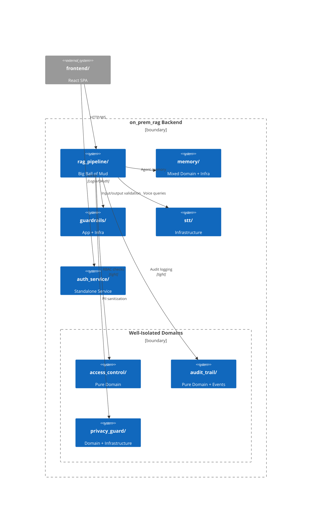

# DDD Current Architecture Analysis

> **Date:** 2026-06-26
> **Scope:** Full codebase audit from a Domain-Driven Design perspective
> **Purpose:** Identify the de facto architecture, big balls of mud, tangled dependencies, missing domain models, and ubiquitous language issues before planning extraction.

---

## 1. Package Map: Current State

```
src/backend/
├── access_control/       ✅ Good domain layer (value objects only, no entities)
├── audit_trail/          ✅ Good domain layer (entities + value objects)
├── auth_service/         🔶 Standalone FastAPI microservice (infrastructure)
├── data_analysis/        🔶 Utility service (supporting subdomain)
├── datetime_utils.py     🔶 Simple utility
├── guardrails/           🔶 Application/infrastructure mix
├── memory/               🔶 Mixed domain+infrastructure in __init__.py
├── privacy_guard/        ✅ Good domain/infrastructure split
├── rag_pipeline/         ❌ BIG BALL OF MUD (11 sub-packages, 50+ files)
│   ├── agents/           Medical-domain agents embedded in generic pipeline
│   ├── api/              FastAPI routes, middleware, websockets
│   ├── config/           LLM/embedding/retrieval config (value objects)
│   ├── core/             Chunking, embeddings, retrieval, vector store, LLM, QA
│   ├── evaluation/       RAG evaluation metrics + CLI
│   ├── models/           Pydantic API schemas (not domain models)
│   ├── services/         Thin service wrappers
│   ├── tasks/            CrewAI task definitions
│   ├── utils/            PDF/DOCX processing, logging, CUDA, progress
│   └── main.py           Module-level entry point
├── security/             🔶 Single JWT utility file
├── session_detection.py  🔶 Simple utility
├── shared/               🔶 Directory/env utilities
└── stt/                  🔶 Speech-to-text service
```

---

## 2. DDD Layer Mapping: Current Reality

### 2.1 Domain Layer

Files that contain actual domain logic (business rules, entities, value objects):

| Package | Files | Quality |
|---------|-------|---------|
| `access_control/domain/` | `value_objects.py` | ✅ **Excellent** — Role, Permission, DataScope, AccessDecision with clear invariants |
| `audit_trail/domain/` | `entities.py`, `value_objects.py` | ✅ **Excellent** — CloudQueryAuditEntry, GuardrailEventEntry, PatientIsolationAuditEntry |
| `privacy_guard/domain/` | `value_objects.py` | ✅ **Excellent** — PIICategory, PIIType, PIIDetection, Transformation, AnonymizedText, CloudEligibility |
| `rag_pipeline/core/` | `chunking.py`, `retrieval.py` | 🔶 **Partial** — Strategy pattern for chunking/retrieval, but mixed with infrastructure |
| `rag_pipeline/core/` | `llm_providers.py` | 🔶 **Partial** — LLMProvider abstraction is domain, but implementations are infrastructure |
| `rag_pipeline/agents/` | Various agents | 🔶 **Partial** — Agent domain logic mixed with CrewAI framework concerns |
| `rag_pipeline/config/` | `parameter_sets.py` | 🔶 **Configuration, not domain** — RAGParams etc are parameter objects, not domain |

### 2.2 Application Layer

Orchestration, use-case coordination, no business rules:

| Package | Files | Notes |
|---------|-------|-------|
| `rag_pipeline/services/` | `document_processing_service.py`, `query_service.py`, `file_upload_service.py` | 🔶 Thin services, some orchestration |
| `guardrails/` | `guardrails_manager.py` | 🔶 Orchestrates NeMo + custom guardrails |
| `memory/` | `__init__.py` (MemoryManager) | 🔶 Unifies three memory stores |
| `rag_pipeline/agents/` | `orchestrator.py` | 🔶 CrewAI orchestration |

### 2.3 Infrastructure Layer

External integrations, persistence, frameworks:

| Package | Files | Notes |
|---------|-------|-------|
| `rag_pipeline/core/` | `vector_store.py`, `bm25_store.py`, `embeddings.py` | ChromaDB integration |
| `rag_pipeline/core/` | `llm_providers.py` (implementations) | Ollama, LiteLLM, HuggingFace integrations |
| `rag_pipeline/core/` | `document_loader.py` | File I/O, LlamaIndex readers |
| `rag_pipeline/api/` | All route files, middleware | FastAPI, websockets |
| `auth_service/` | `main.py`, `database.py`, `models.py` | Standalone FastAPI microservice |
| `guardrails/` | `config_loader.py`, `input_guardrails.py`, `output_guardrails.py` | NeMo integration |
| `privacy_guard/infrastructure/` | `llm_prompts.py` | LLM prompt templates for PII detection |
| `stt/` | `service.py`, `transcriber.py`, `corrector.py` | faster-whisper integration |
| `security/` | `security_manager.py` | JWT utilities |

### 2.4 Presentation Layer

User-facing interfaces:

| Package | Files | Notes |
|---------|-------|-------|
| `rag_pipeline/api/` | `app.py`, route files | FastAPI HTTP + WebSocket endpoints |
| `frontend/` | React SPA | TypeScript + React |

---

## 3. Subdomain Classification

### 3.1 Core Subdomains (Competitive advantage, complex business logic)

| Subdomain | Location | Why Core |
|-----------|----------|----------|
| **Knowledge Retrieval** | `rag_pipeline/core/` (chunking, embeddings, retrieval) | Core differentiator — quality of RAG determines product value |
| **Privacy & PII Guard** | `privacy_guard/` | Compliance-critical for healthcare context |
| **Audit & Compliance** | `audit_trail/` | WBSO evidence generation, regulatory requirements |
| **Access Control** | `access_control/` | Multi-role data isolation in healthcare context |

### 3.2 Supporting Subdomains (Needed but not differentiating)

| Subdomain | Location | Why Supporting |
|-----------|----------|----------------|
| **Document Ingestion** | `rag_pipeline/core/document_loader.py`, `rag_pipeline/services/document_processing_service.py` | Essential pipeline step, but standardized |
| **Agent Orchestration** | `rag_pipeline/agents/` (MedicalCrewOrchestrator) | Medical analysis workflow is supporting to core RAG |
| **Memory Management** | `memory/` | Session/entity/vector memory for agents |
| **LLM Gateway** | `rag_pipeline/core/llm_providers.py`, `rag_pipeline/config/llm_config.py` | LLM abstraction, model routing |

### 3.3 Generic Subdomains (Commodity, buy-don't-build)

| Subdomain | Location | Why Generic |
|-----------|----------|-------------|
| **Authentication** | `auth_service/` | JWT/OAuth2 — standard pattern |
| **Speech-to-Text** | `stt/` | faster-whisper wrapper — off-the-shelf |
| **Data Analysis** | `data_analysis/` | Time series — utility function |
| **Guardrails** | `guardrails/` | NeMo Guardrails wrapper — framework integration |
| **File Storage** | Filesystem + ChromaDB | Standard persistence |

---

## 4. Tangled Dependencies

### 4.1 The `rag_pipeline/` God Package

The most significant architectural debt. The package is internally cohesive but externally impossible to extract or test in isolation:

```
rag_pipeline/
├── api/      ←── imports from ──→ core/, services/, config/, utils/
│                                  ↕ (bidirectional)
├── core/     ←── imports from ──→ config/, utils/
│                                  ↕
├── services/ ←── imports from ──→ core/, config/, models/, utils/
│
├── agents/   ←── imports from ──→ tasks/, core/ (via LLM)
│
├── config/   ←── imports from ──→ shared/utils/ (env)
│
├── models/   (standalone, no internal deps) ✅
│
├── utils/    (standalone, few deps) ✅
│
└── evaluation/ ←── imports from ──→ core/, config/
```

**Specific tangles:**

1. **`core/embeddings.py` imports from `core/chunking.py`** — embedding couples to chunking format
2. **`core/qa_system.py` imports from `config/parameter_sets.py`** — domain logic depends on config structure
3. **`core/retrieval.py` imports from `config/vector_store.py` and `core/bm25_store.py`** — retrieval couples to both
4. **`api/app.py` imports from `config/llm_config.py`** — presentation layer depends on config
5. **`services/` re-exports from `core/`** — adding indirection without encapsulation
6. **`agents/` imports from `core/llm_providers.py`** — agent layer couples to LLM provider interface

### 4.2 Cross-Package Dependencies

```
rag_pipeline/ ──→ shared/utils/      (env_utils, directory_utils)
memory/        ──→ [no external deps] (self-contained) ✅
guardrails/    ──→ [NeMo external]     (wrapper pattern)
privacy_guard/ ──→ [standalone]        (domain + infrastructure) ✅
access_control/──→ [standalone]        (pure domain) ✅
audit_trail/   ──→ [standalone]        (pure domain) ✅
```

### 4.3 External Package Dependencies

The project depends on these major external packages, creating implicit coupling boundaries:

| External Package | Used By | Risk |
|-----------------|---------|------|
| LlamaIndex | `rag_pipeline/core/` (chunking, embeddings, document loader) | **Heavy lock-in** — Document = LlamaIndex Document |
| ChromaDB | `rag_pipeline/core/vector_store.py` | Tight coupling, hard to swap |
| LiteLLM | `rag_pipeline/core/llm_providers.py` | Moderate coupling |
| CrewAI | `rag_pipeline/agents/` | Framework coupling in agents |
| NeMo Guardrails | `guardrails/` | Wrapper isolates well |
| faster-whisper | `stt/` | Well-encapsulated |

---

## 5. Missing Domain Models

### 5.1 Logic in Services Instead of Domain Objects

| Current Location | Logic | Should Be |
|-----------------|-------|-----------|
| `rag_pipeline/services/query_service.py` | Trivial pass-through | Should encapsulate query intent/context |
| `rag_pipeline/services/document_processing_service.py` | Processing pipeline orchestration | Domain service for ingestion workflow |
| `rag_pipeline/core/qa_system.py` | Answer generation + prompt building | **Missing `Query` and `Answer` domain entities** with behavior |
| `rag_pipeline/core/embeddings.py` | `process_document()` orchestrates loading, chunking, embedding | **Missing `IngestionWorkflow` aggregate** |
| `rag_pipeline/core/rag_system.py` | Legacy RAG orchestration | Should be deprecated or refactored |

### 5.2 Missing Aggregates

| Aggregate Root | Currently | Missing |
|---------------|-----------|---------|
| **Document** | Pydantic schema in `models/document_models.py` | No identity tracking lifecycle, no versioning, no validity periods |
| **Chunk** | LlamaIndex `Document`/`TextNode` | No domain identity, mixed with framework type |
| **Query** | Raw string | No value object for query intent, context, parameters |
| **Answer** | Raw string + dict | No value object with confidence, sources, citations |
| **IngestionJob** | None | No aggregate for tracking multi-file processing |
| **Conversation** | `memory/models.py` has `ConversationContext` | Partial — not used by QASystem |

### 5.3 Missing Domain Events

| Event | Should Be | Currently Handled |
|-------|-----------|-------------------|
| DocumentUploaded | Domain event | Raw HTTP request |
| ChunkingCompleted | Domain event | Log statement |
| EmbeddingGenerated | Domain event | Log statement |
| QuerySubmitted | Domain event | Raw API call |
| AnswerGenerated | Domain event | Return value |
| PIIDetected | Domain event | Audit trail entry |
| CloudQueryRouted | Domain event | Audit trail entry |

---

## 6. Implicit Aggregate Boundaries

The system has implicit boundaries that are not enforced:

```
           ┌──────────────────────────────────────────┐
           │           INGESTION AGGREGATE              │
           │  (no identity, no repository, no events)   │
           │                                            │
           │  DocumentUpload → Load → Chunk → Embed     │
           │                                            │
           └──────────────────────────────────────────┘
                         ↓
           ┌──────────────────────────────────────────┐
           │           RETRIEVAL AGGREGATE              │
           │  (no identity, no repository, no events)   │
           │                                            │
           │  Query → Retrieve → Rerank → Answer        │
           │                                            │
           └──────────────────────────────────────────┘
```

Neither aggregate has:
- A formal aggregate root
- A repository interface
- Domain events for state changes
- Transactional boundaries

---

## 7. Ubiquitous Language Audit

### 7.1 Inconsistencies

| Term | Meaning in Context A | Meaning in Context B | Conflict |
|------|---------------------|---------------------|----------|
| **Document** | `rag_pipeline/models/document_models.py`: API schema (id, filename, size, status) | `rag_pipeline/core/document_loader.py` + LlamaIndex: Framework Document with text + metadata | Same name, different structures |
| **Chunk** | `rag_pipeline/core/chunking.py`: `ChunkingResult` with `list[Document]` | LlamaIndex: `BaseNode`, `TextNode` | Mixed naming |
| **Query** | `rag_pipeline/models/`: `QueryResponse` (search results) | User asking a question | Overloaded |
| **Memory** | `memory/`: Three-layer system (session, vector, entity) | CrewAI's built-in memory | Different abstractions |
| **Model** | `rag_pipeline/config/llm_config.py`: `LLMConfig` backend/model | Embedding model in `EmbeddingParams` | Same word, different domains |
| **Entity** | `access_control/domain/value_objects.py`: Has `Role` enum | `audit_trail/domain/entities.py`: Has `@dataclass` entities | Different modeling patterns |
| **Provider** | `rag_pipeline/core/llm_providers.py`: LLM provider | `rag_pipeline/core/document_loader.py`: File processor | Same term, different domains |

### 7.2 Terms Used Across Bounded Contexts (Shared Language)

| Term | Contexts Using It | Alignment |
|------|------------------|-----------|
| **PII** | privacy_guard, audit_trail, guardrails | ✅ Consistent |
| **Role** | access_control, auth_service | 🔶 Different implementations |
| **Session** | auth_service, memory | 🔶 Different meanings (auth vs conversation) |
| **Token** | privacy_guard (anonymization), security (JWT), LLM (tokens) | ❌ Three different meanings |
| **Vector** | rag_pipeline/core (embeddings), memory (vector_memory) | ✅ Consistent |

---

## 8. Summary of Key Findings

### 🔴 Critical Issues

1. **`rag_pipeline/` is a god package** — 11 sub-packages, 50+ files, mixing presentation, application, domain, and infrastructure across at least 5 distinct bounded contexts
2. **Domain logic leaks into services** — `QASystem`, `DocumentProcessingService`, and `embeddings.process_document()` all contain business logic that belongs in domain models
3. **LlamaIndex model leakage** — The LlamaIndex `Document` type infests the entire codebase, creating a framework lock-in that prevents easy swap or extraction
4. **No aggregate boundaries** — Ingestion and retrieval workflows have no formal transaction boundaries, repository interfaces, or domain events

### 🟡 Concerning Issues

5. **Medical analysis agents in RAG pipeline** — `rag_pipeline/agents/` contains medical-domain-specific agents (ClinicalExtractor, LanguageAssessor) that violate the single-responsibility of the RAG pipeline
6. **Memory package mixes concerns** — `memory/__init__.py` (690 lines) contains MemoryManager, global singleton, and re-exports from all submodules — violates Interface Segregation
7. **Two RAG systems** — `LocalRAGSystem` (legacy, in `core/rag_system.py`) and the new modular pipeline co-exist, confusing domain boundaries
8. **Config as domain** — `config/` package contains domain-like structures (parameter sets) that are really application configuration, not domain concepts

### 🟢 Well-Architected Areas

9. **`access_control/`** — Clean domain layer with pure value objects, enum-based roles, and permission matrix documentation
10. **`audit_trail/`** — Well-structured entities with clear WBSO evidence purpose and privacy-preserving design
11. **`privacy_guard/`** — Proper domain/infrastructure separation, rich value objects with behavior (PIIType.matches(), AnonymizedText.to_audit_entry())

---

## 9. Current Context Map



The `rag_pipeline/` package acts as a **big ball of mud** context that all other contexts communicate through. Well-structured domains (`access_control/`, `audit_trail/`, `privacy_guard/`) are currently **conformist** — they must conform to rag_pipeline's arbitrary interfaces.
