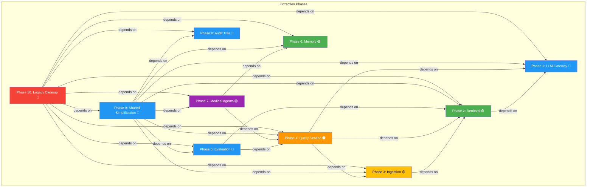

# DDD Extraction Plan

> **Date:** 2026-06-26
> **Context:** Breaking the `rag_pipeline/` god package into clean bounded contexts
> **Prerequisites:** Read `DDD_CURRENT_ARCHITECTURE.md` and `DDD_TARGET_ARCHITECTURE.md` first

---

## 1. Strategic Approach

### Guiding Principles

1. **Extract, don't rewrite** — Each phase moves code to new packages while keeping the old import path working via compatibility shims
2. **Interface-first** — Define port interfaces before extracting implementations
3. **Test in flight** — After each extraction phase, run full test suite before committing
4. **Bottom-up extraction** — Extract leaf dependencies first (LLM Gateway), then work inward (Retrieval → Ingestion → Query Service)
5. **Keep API stable** — Frontend should not notice the refactoring until the final phase

### Extraction Patterns

For each BC extraction, follow this pattern:

```
1. Define port interfaces in new package
2. Create adapter from old package to new port
3. Move implementations to new package
4. Replace direct imports with interface usage
5. Delete old code + compatibility shim
6. Update tests
7. Run full test suite
```

---

## 2. Phase Breakdown

---

### Phase 1: LLM Gateway Extraction

**Effort:** S (Small)  
**Risk:** Low  
**Dependencies:** None  
**BC:** LLM Gateway

#### Steps

| # | Step | Files | Details |
|---|------|-------|---------|
| 1.1 | Create package skeleton | `src/backend/llm_gateway/` | `__init__.py`, `domain/`, `infrastructure/`, `ports/` |
| 1.2 | Define `ILLMProvider` port | `llm_gateway/ports/llm_provider.py` | Abstract interface with `generate()`, `generate_stream()`, `health_check()` |
| 1.3 | Define `IEmbeddingProvider` port | `llm_gateway/ports/embedding_provider.py` | Abstract interface with `get_text_embedding()` |
| 1.4 | Move value objects | `llm_gateway/domain/value_objects.py` | `Prompt`, `Completion`, `ModelIdentifier`, `ProviderType` from scratch |
| 1.5 | Move `LiteLLMProvider` | `llm_gateway/infrastructure/litellm_provider.py` | From `rag_pipeline/core/llm_providers.py` |
| 1.6 | Move `OllamaProvider` | `llm_gateway/infrastructure/ollama_provider.py` | From `rag_pipeline/core/llm_providers.py` |
| 1.7 | Move `LLMConfig` + `check_data_sovereignty` | `llm_gateway/infrastructure/config.py` | From `rag_pipeline/config/llm_config.py` |
| 1.8 | Create compatibility shim | `rag_pipeline/core/llm_providers.py` | Re-export from `llm_gateway` — other code continues to work |
| 1.9 | Move tests | `llm_gateway/test/` | From `tests/` related to LLM providers |
| 1.10 | Run full test suite | — | Verify nothing is broken |

#### Result

After Phase 1:
```
src/backend/llm_gateway/     ✅ New, independent
src/backend/rag_pipeline/core/llm_providers.py   🔶 Shim (re-exports only)
src/backend/rag_pipeline/config/llm_config.py    🔶 Shim (re-exports only)
```

---

### Phase 2: Retrieval BC Extraction

**Effort:** M (Medium)  
**Risk:** Medium  
**Dependencies:** Phase 1 (uses `IEmbeddingProvider`)  
**BC:** Retrieval

#### Steps

| # | Step | Files | Details |
|---|------|-------|---------|
| 2.1 | Create package skeleton | `src/backend/retrieval/` | `__init__.py`, `domain/`, `application/`, `infrastructure/` |
| 2.2 | Define `IVectorStoreRead` port | `retrieval/ports/vector_store.py` | Read-only interface: `search()`, `get_chunk_count()` |
| 2.3 | Define domain value objects | `retrieval/domain/value_objects.py` | `QueryVector`, `SearchResult`, `SimilarityScore`, `RetrievalStrategy` |
| 2.4 | Move `DenseRetriever` | `retrieval/domain/services.py` | From `rag_pipeline/core/retrieval.py` — make it depend on `IEmbeddingProvider` instead of concrete `query_embeddings` |
| 2.5 | Move `SparseRetriever` + `BM25Store` | `retrieval/infrastructure/bm25_store.py` | From `rag_pipeline/core/bm25_store.py` |
| 2.6 | Move `HybridRetriever` + RRF | `retrieval/domain/services.py` | From `rag_pipeline/core/retrieval.py` |
| 2.7 | Move `CrossEncoderReranker` | `retrieval/application/reranking.py` | From `rag_pipeline/core/retrieval.py` |
| 2.8 | Move `RetrievalService` | `retrieval/application/search_service.py` | From `rag_pipeline/core/retrieval.py` |
| 2.9 | Move `VectorStoreManager` | `retrieval/infrastructure/vector_store.py` | From `rag_pipeline/core/vector_store.py` — split into read-only (for retrieval) and write (for ingestion) |
| 2.10 | Create write port for ingestion | `retrieval/ports/vector_store_write.py` | Write interface: `add()`, `delete_by_document_name()`, `has_document_with_hash()` |
| 2.11 | Create compatibility shim | `rag_pipeline/core/retrieval.py`, `vector_store.py`, `bm25_store.py` | Re-export from `retrieval` |
| 2.12 | Move vector store config | `retrieval/infrastructure/vector_store_config.py` | From `rag_pipeline/config/vector_store.py` |
| 2.13 | Move tests | `retrieval/test/` | |
| 2.14 | Run full test suite | — | |

#### Result

After Phase 2:
```
src/backend/llm_gateway/       ✅ (from Phase 1)
src/backend/retrieval/         ✅ New, depends on llm_gateway embeddings
src/backend/rag_pipeline/core/retrieval.py      🔶 Shim
src/backend/rag_pipeline/core/vector_store.py   🔶 Shim
src/backend/rag_pipeline/core/bm25_store.py     🔶 Shim
```

---

### Phase 3: Ingestion BC Extraction

**Effort:** M (Medium)  
**Risk:** Medium-High (tight LlamaIndex coupling)  
**Dependencies:** Phase 2 (needs `IVectorStoreWrite`)  
**BC:** Ingestion

#### Steps

| # | Step | Files | Details |
|---|------|-------|---------|
| 3.1 | Create package skeleton | `src/backend/ingestion/` | `__init__.py`, `domain/`, `application/`, `infrastructure/`, `ports/` |
| 3.2 | Define ports | `ingestion/ports/` | `IVectorStoreWrite` (from Retrieval BC), `IDocumentLoader`, `IEmbeddingGenerator` |
| 3.3 | Define domain aggregates | `ingestion/domain/aggregates.py` | `IngestionJob` aggregate root with lifecycle |
| 3.4 | Define value objects | `ingestion/domain/value_objects.py` | `Chunk`, `ChunkMetadata`, `FileContentHash`, `IngestionResult` |
| 3.5 | Define domain events | `ingestion/domain/events.py` | `DocumentLoaded`, `ChunkingCompleted`, `EmbeddingCompleted`, `IngestionFinished` |
| 3.6 | Move `DocumentLoader` | `ingestion/infrastructure/document_loader.py` | From `rag_pipeline/core/document_loader.py` — **refactor to not depend on LlamaIndex `Document` type** |
| 3.7 | Move `Chunker` | `ingestion/infrastructure/chunking.py` | From `rag_pipeline/core/chunking.py` — return domain `Chunk` objects instead of LlamaIndex `TextNode` |
| 3.8 | Move `EmbeddingService` | `ingestion/infrastructure/embedding.py` | From `rag_pipeline/core/embeddings.py` — use `IEmbeddingGenerator` port |
| 3.9 | Create `IngestionService` | `ingestion/application/ingest_service.py` | Replace `DocumentProcessingService` from `rag_pipeline/services/` |
| 3.10 | Move `ProgressEvent` + notifier | `ingestion/application/progress_notifier.py` | From `rag_pipeline/utils/progress.py` |
| 3.11 | Create compatibility shims | `rag_pipeline/core/document_loader.py`, `chunking.py`, `embeddings.py`, `services/` | Re-export from `ingestion` (orchestrate adapters) |
| 3.12 | Move tests | `ingestion/test/` | |
| 3.13 | Run full test suite | — | |

#### LlamaIndex Decoupling Strategy

The biggest challenge in Phase 3. Current code uses `from llama_index.core import Document` everywhere. Strategy:

1. Create an `IngestionDocument` domain class in `ingestion/domain/`
2. Add an adapter in `ingestion/infrastructure/adapters/llamaindex_adapter.py` that converts `LlamaIndex.Document` ↔ `IngestionDocument`
3. The chunker works with domain types; only the loader adapter touches LlamaIndex
4. Over time, LlamaIndex readers can be replaced with simpler readers

#### Result

After Phase 3:
```
src/backend/ingestion/         ✅ New, depends on retrieval (write port)
src/backend/rag_pipeline/core/document_loader.py   🔶 Shim
src/backend/rag_pipeline/core/chunking.py          🔶 Shim
src/backend/rag_pipeline/core/embeddings.py        🔶 Shim
src/backend/rag_pipeline/services/                 🔶 Shims
```

---

### Phase 4: Query Service BC Extraction

**Effort:** L (Large)  
**Risk:** High (orchestrates all other BCs, has API endpoints)  
**Dependencies:** Phase 1, 2, 3  
**BC:** Query Service

#### Steps

| # | Step | Files | Details |
|---|------|-------|---------|
| 4.1 | Create package skeleton | `src/backend/query_service/` | Including `api/`, `adapters/` |
| 4.2 | Define domain aggregates | `query_service/domain/aggregates.py` | `Conversation` aggregate root with multi-turn tracking |
| 4.3 | Define domain entities + value objects | `query_service/domain/` | `Query`, `Answer`, `Citation`, `Confidence`, `QueryIntent` |
| 4.4 | Define domain events | `query_service/domain/events.py` | `QueryReceived`, `ContextRetrieved`, `AnswerGenerated` |
| 4.5 | Move `QASystem` → `QueryOrchestrator` | `query_service/application/query_orchestrator.py` | Refactor from `rag_pipeline/core/qa_system.py` |
| 4.6 | Create `PromptBuilder` | `query_service/application/prompt_builder.py` | Extract prompt construction logic from `qa_system.py` |
| 4.7 | Create ACL adapters | `query_service/adapters/` | `access_control.py`, `privacy_guard.py`, `retrieval.py` — anti-corruption layers |
| 4.8 | Move API routes | `query_service/api/` | Extract from `rag_pipeline/api/` — maintain same URLs for frontend |
| 4.9 | Move middleware | `query_service/api/middleware/` | Rate limiting, correlation ID, audit logging |
| 4.10 | Move API app factory | `query_service/api/app.py` | Create FastAPI app with extracted routes |
| 4.11 | Create main entry point | `query_service/main.py` | From `rag_pipeline/main.py` and `rag_pipeline/api/app.py` |
| 4.12 | Create compatibility shim | `rag_pipeline/core/qa_system.py` | Re-export |
| 4.13 | Move tests | `query_service/test/` | |
| 4.14 | Run full test suite | — | |

#### API Compatibility Strategy

The frontend talks to specific endpoints. During this phase:

1. Keep old `rag_pipeline/api/` routes working (they become thin wrappers calling `query_service`)
2. Move route registration to `query_service/api/`
3. eventually point `rag_pipeline/api/app.py` to include `query_service.api.routers`

#### Result

After Phase 4:
```
src/backend/query_service/     ✅ New flagship BC
src/backend/rag_pipeline/api/  🔶 Shim (thin wrappers)
src/backend/rag_pipeline/core/qa_system.py  🔶 Shim
```

---

### Phase 5: Evaluation BC Extraction

**Effort:** S (Small)  
**Risk:** Low  
**Dependencies:** Phase 2, 4 (needs Retrieval + Query Service to be clean)  
**BC:** Evaluation

#### Steps

| # | Step | Details |
|---|-------|---------|
| 5.1 | Move `rag_pipeline/evaluation/` → `src/backend/evaluation/` | Simple file move |
| 5.2 | Refactor to depend on Retrieval BC + Query Service BC interfaces | Instead of importing from `rag_pipeline.core` |
| 5.3 | Create compatibility shim | In `rag_pipeline/evaluation/` |
| 5.4 | Run full test suite | |

---

### Phase 6: Memory BC Refinement

**Effort:** M (Medium)  
**Risk:** Medium  
**Dependencies:** None (self-contained)  
**BC:** Memory

#### Steps

| # | Step | Details |
|---|-------|---------|
| 6.1 | Split `memory/__init__.py` (690 lines) | Extract `MemoryManager` → `memory/application/memory_manager.py` |
| 6.2 | Define port interfaces | `memory/ports/stores.py` — `ISessionStore`, `IVectorMemory`, `IEntityStore` |
| 6.3 | Move implementations to infrastructure | `memory/infrastructure/session_store.py`, `vector_memory.py`, `entity_store.py` |
| 6.4 | Define domain value objects | `memory/domain/value_objects.py` — `MemoryDocument`, `SearchResult`, `MemoryType`, `Importance` |
| 6.5 | Remove global singleton pattern | Replace `get_memory_manager()` with dependency injection (optional) |
| 6.6 | Move tests | `memory/test/` |
| 6.7 | Run full test suite | |

---

### Phase 7: Medical Agents BC Extraction

**Effort:** S (Small)  
**Risk:** Low  
**Dependencies:** Phase 4 (needs Query Service), Phase 6 (needs Memory)  
**BC:** Medical Agents

#### Steps

| # | Step | Details |
|---|-------|---------|
| 7.1 | Move `rag_pipeline/agents/` → `src/backend/medical_agents/` | File move |
| 7.2 | Move `rag_pipeline/tasks/` → `medical_agents/application/tasks/` | Task definitions |
| 7.3 | Refactor `MedicalCrewOrchestrator` to use `QueryService` port | Instead of importing `QASystem` directly |
| 7.4 | Create compatibility shim | In `rag_pipeline/agents/` |
| 7.5 | Run full test suite | |

---

### Phase 8: Audit Trail Application Layer

**Effort:** S (Small)  
**Risk:** Low  
**Dependencies:** None  
**BC:** Audit Trail

#### Steps

| # | Step | Details |
|---|-------|---------|
| 8.1 | Add `audit_trail/application/audit_service.py` | Application service that coordinates audit entry creation |
| 8.2 | Add `audit_trail/application/wbso_report_generator.py` | WBSO evidence report generation from audit entries |
| 8.3 | Add `audit_trail/ports/audit_store.py` | Interface for persistence |
| 8.4 | Add `audit_trail/infrastructure/audit_store.py` | Default in-memory/file-based implementation |
| 8.5 | Define published event schema | `AuditEvent` that other BCs publish to |
| 8.6 | Run full test suite | |

---

### Phase 9: Shared Package Simplification

**Effort:** S (Small)  
**Risk:** Low  
**Dependencies:** All other phases  
**BC:** N/A — infrastructure concern

#### Steps

| # | Step | Details |
|---|-------|---------|
| 9.1 | Move `shared/utils/env_utils.py` → move to each BC's config | Each BC should read its own env vars |
| 9.2 | Move `shared/utils/directory_utils.py` → move to filesystem abstraction | Or eliminate if each BC manages its own dirs |
| 9.3 | Run full test suite | |

---

### Phase 10: Delete Legacy Code

**Effort:** S (Small)  
**Risk:** Medium  
**Dependencies:** All previous phases

#### Steps

| # | Step | Details |
|---|-------|---------|
| 10.1 | Remove all `rag_pipeline/` compatibility shims | After confirming no imports remain |
| 10.2 | Delete `rag_pipeline/` directory | The god package is dead |
| 10.3 | Rename `rag_pipeline/main.py` entry points to new locations | Update package.json scripts |
| 10.4 | Run full integration test suite | End-to-end test with frontend |
| 10.5 | Update documentation | Point all docs to new BC package paths |

---

## 3. Dependency Graph



---

## 4. Detailed Phase: Extracting rag_pipeline/core/ (Breakdown)

The `rag_pipeline/core/` package contains 14 files that must be split across three BCs:

| File | Destination BC | Phase |
|------|---------------|-------|
| `llm_providers.py` | LLM Gateway | 1 |
| `llama_compat.py` | LLM Gateway (or deprecated) | 1 |
| `bm25_store.py` | Retrieval | 2 |
| `vector_store.py` | Retrieval (read) + Ingestion (write) | 2-3 |
| `retrieval.py` | Retrieval | 2 |
| `embeddings.py` | Ingestion (embed) + Retrieval (query) | 2-3 |
| `chunking.py` | Ingestion | 3 |
| `document_loader.py` | Ingestion | 3 |
| `rag_system.py` | Legacy — deprecate after extraction | 10 |
| `qa_system.py` | Query Service | 4 |
| `metadata_store.py` | Ingestion (or deprecate) | 3 |
| `db_query.py` | Query Service | 4 |

---

## 5. Risk Register

| Risk | Phase | Severity | Mitigation |
|------|-------|----------|------------|
| LlamaIndex `Document` type infests codebase | 3 | High | Adapter pattern with domain `IngestionDocument` |
| API endpoint disruption | 4 | High | Compatibility shims, keep old routes alive |
| Circular imports between new BCs | 2-4 | Medium | Design ports/interfaces first, enforce dependency direction |
| Test coverage gaps after extraction | All | Medium | Write tests before extraction when possible |
| Configuration scatters across BCs | 9 | Low | Each BC gets own config; remove `shared/utils/env_utils.py` |
| CrewAI framework coupling in agents | 7 | Low | Keep adapter pattern, don't fight the framework |

---

## 6. Estimated Effort Summary

| Phase | BC | Effort | Risk | Timeline (days) |
|-------|----|--------|------|-----------------|
| 1 | LLM Gateway | S | Low | 1-2 |
| 2 | Retrieval | M | Medium | 3-5 |
| 3 | Ingestion | M | Medium-High | 4-6 |
| 4 | Query Service | L | High | 5-8 |
| 5 | Evaluation | S | Low | 1-2 |
| 6 | Memory | M | Medium | 2-3 |
| 7 | Medical Agents | S | Low | 1-2 |
| 8 | Audit Trail | S | Low | 1-2 |
| 9 | Shared | S | Low | 1 |
| 10 | Legacy Cleanup | S | Medium | 1 |

**Total estimated effort: ~20-32 days** (assuming dedicated focus, single developer)

---

## 7. Quick Wins (Do First)

Before starting the formal extraction phases, these low-effort improvements can be made immediately:

1. **Move `evaluation/` out of `rag_pipeline/`**  
   Effort: 30 minutes. Simple file move with import fix.

2. **Split `memory/__init__.py`**  
   Effort: 2 hours. Extract `MemoryManager` class to own file; keep `__init__.py` clean.

3. **Add `llm_gateway/ports/` package**  
   Effort: 1 hour. Define interfaces even if implementations are still in `rag_pipeline/`.

4. **Create domain value objects for `Query` and `Answer`**  
   Effort: 2 hours. Even if not used yet, define them in `query_service/domain/`.

5. **Add audit trail persistence port**  
   Effort: 1 hour. Define `IAuditStore` interface in `audit_trail/ports/`.
