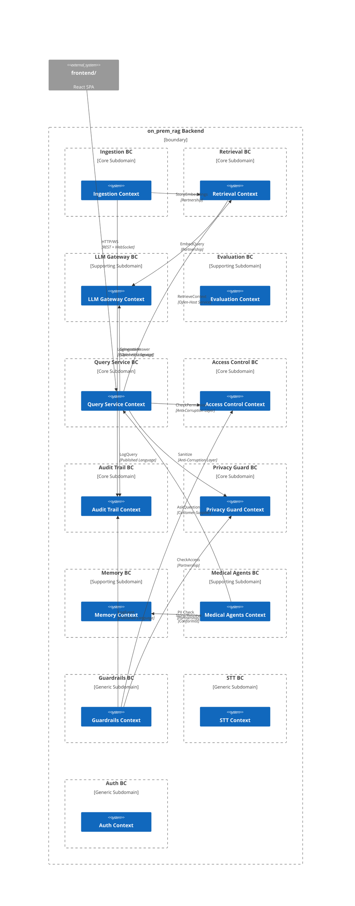
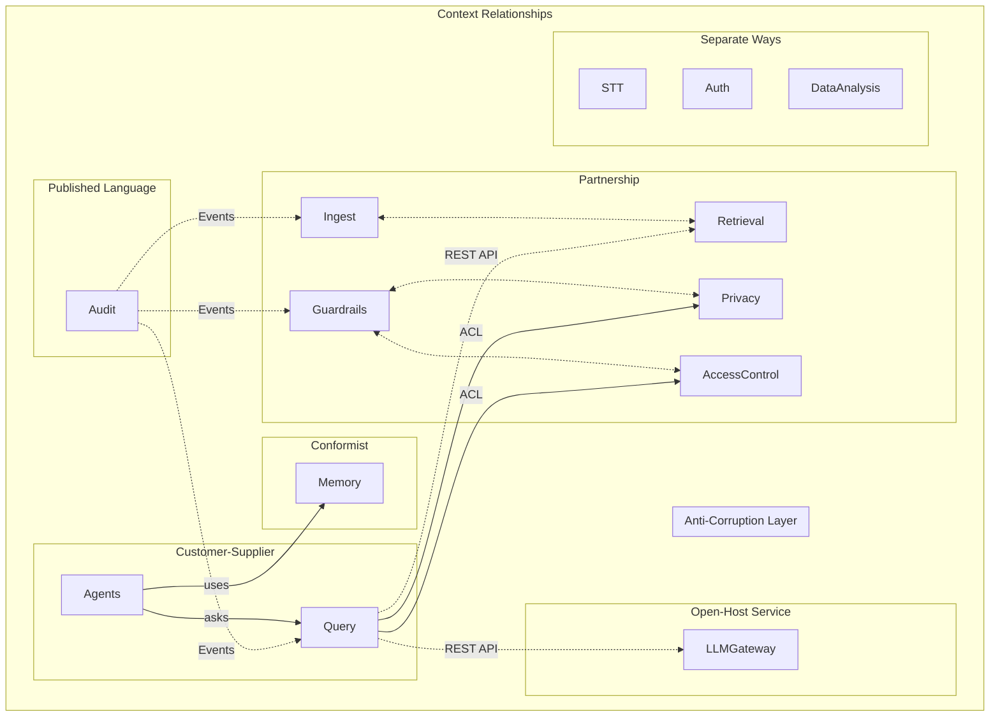
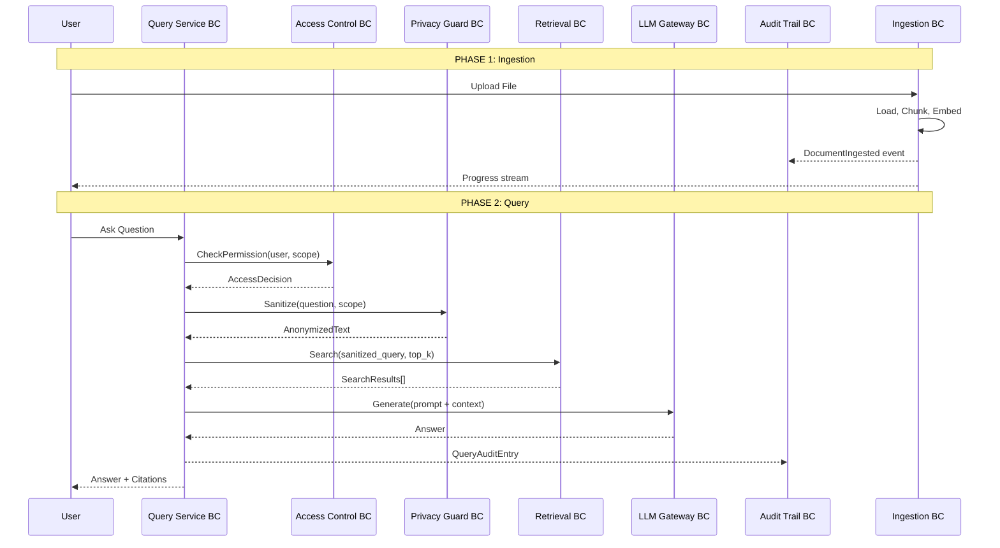

# DDD Target Architecture

> **Date:** 2026-06-26
> **Scope:** Redesign of `src/backend/` into clean bounded contexts
> **Prerequisite:** Read `DDD_CURRENT_ARCHITECTURE.md` first for baseline understanding

---

## 1. Target Bounded Context Map



---

## 2. Bounded Context Definitions

### 2.1 Ingestion BC

| Aspect | Detail |
|--------|--------|
| **Domain Type** | Core |
| **Responsibility** | Receive uploaded files, load text, chunk into pieces, generate embeddings, store in vector store |
| **Aggregate Root** | `IngestionJob` — tracks a batch of document processing from upload to storage |
| **Entities** | `IngestionJob`, `FileSource` |
| **Value Objects** | `Chunk`, `ChunkMetadata`, `IngestionResult`, `FileContentHash` |
| **Domain Services** | `DocumentLoader` (load files → text), `Chunker` (text → chunks), `EmbeddingService` (chunks → vectors) |
| **Domain Events** | `DocumentLoaded`, `ChunkingCompleted`, `EmbeddingCompleted`, `IngestionFinished`, `DuplicateSkipped` |
| **Inbound Ports** | `ProcessFile(file)`, `ProcessBatch(files)`, `GetStatus(jobId)`, `CancelJob(jobId)` |
| **Outbound Ports** | `VectorStore` (save embeddings), `AuditTrail` (log events), `ProgressNotifier` (stream progress) |
| **Infrastructure** | `ChromaDBVectorStore`, `FileSystemWatcher`, `ProgressWebSocket` |
| **Current Location** | `rag_pipeline/core/document_loader.py`, `rag_pipeline/core/chunking.py`, `rag_pipeline/core/embeddings.py`, `rag_pipeline/services/document_processing_service.py` |

### 2.2 Retrieval BC

| Aspect | Detail |
|--------|--------|
| **Domain Type** | Core |
| **Responsibility** | Provide similarity search over embedded chunks: dense, sparse (BM25), hybrid, with re-ranking and MMR |
| **Aggregate Root** | `Index` — represents a searchable collection of chunks |
| **Value Objects** | `QueryVector`, `SearchResult`, `SimilarityScore`, `RetrievalStrategy` |
| **Domain Services** | `DenseRetriever`, `SparseRetriever`, `HybridRetriever`, `CrossEncoderReranker`, `MMRReranker` |
| **Domain Events** | `SearchExecuted`, `IndexUpdated` |
| **Inbound Ports** | `Search(query, top_k, strategy)`, `ReRank(candidates, query)`, `GetIndexInfo()` |
| **Outbound Ports** | `VectorStore` (read), `BM25Index` (read) |
| **Infrastructure** | `ChromaDBVectorStoreAdapter`, `BM25IndexAdapter` |
| **Current Location** | `rag_pipeline/core/retrieval.py`, `rag_pipeline/core/bm25_store.py`, `rag_pipeline/core/vector_store.py` |

### 2.3 LLM Gateway BC

| Aspect | Detail |
|--------|--------|
| **Domain Type** | Supporting |
| **Responsibility** | Abstract LLM interactions: text generation, streaming, embedding, health checks. Routes to local or cloud providers |
| **Value Objects** | `Prompt`, `Completion`, `TokenCount`, `ModelIdentifier`, `ProviderType` |
| **Domain Services** | `LLMProvider` (interface), `EmbeddingProvider` (interface) |
| **Domain Events** | `LLMQuerySubmitted`, `LLMResponseReceived`, `LLMError` |
| **Inbound Ports** | `Generate(prompt, config)`, `GenerateStream(prompt, config)`, `HealthCheck()`, `GetEmbedding(text)` |
| **Outbound Ports** | None (this BC is the boundary to external) |
| **Infrastructure** | `OllamaProvider`, `LiteLLMProvider`, `HuggingFaceProvider`, `AzureProvider` |
| **Current Location** | `rag_pipeline/core/llm_providers.py`, `rag_pipeline/config/llm_config.py` |

### 2.4 Query Service BC

| Aspect | Detail |
|--------|--------|
| **Domain Type** | Core |
| **Responsibility** | Orchestrate the full RAG workflow: accept user question → check access → sanitize PII → retrieve context → build prompt → generate answer → audit log → return response |
| **Aggregate Root** | `Conversation` — multi-turn Q&A session |
| **Entities** | `Conversation`, `Query` |
| **Value Objects** | `QueryIntent`, `Answer`, `Citation`, `Confidence`, `ConversationContext` |
| **Domain Services** | `QueryOrchestrator`, `PromptBuilder`, `AnswerFormatter` |
| **Domain Events** | `QueryReceived`, `ContextRetrieved`, `AnswerGenerated`, `CitationIncluded` |
| **Inbound Ports** | `Ask(question, user)`, `AskStream(question, user)`, `GetHistory(sessionId)` |
| **Outbound Ports** | `RetrievalBC.Search()`, `LLMGatewayBC.Generate()`, `AccessControlBC.Check()`, `PrivacyGuardBC.Sanitize()`, `AuditTrailBC.Log()` |
| **Current Location** | `rag_pipeline/core/qa_system.py`, `rag_pipeline/services/query_service.py`, `rag_pipeline/api/ask.py`, `rag_pipeline/api/chat.py` |

### 2.5 Access Control BC (Existing ✅, Extract)

| Aspect | Detail |
|--------|--------|
| **Domain Type** | Core |
| **Responsibility** | Role-based access control with data isolation for patient context. See WBSO Knelpunt 1 |
| **Aggregate Root** | `PermissionRegistry` |
| **Entities** | None (stateless) |
| **Value Objects** | `Role`, `Permission`, `DataScope`, `AccessDecision`, `RolePermissions` |
| **Domain Services** | `AccessControlService` |
| **Inbound Ports** | `CheckPermission(role, permission)`, `CheckDataAccess(scope, patientId)`, `ApplyScope(scope, query)` |
| **Current Location** | `access_control/domain/value_objects.py` |

### 2.6 Audit Trail BC (Existing ✅, Extract)

| Aspect | Detail |
|--------|--------|
| **Domain Type** | Core |
| **Responsibility** | Append-only audit logging with privacy preservation. WBSO evidence generation |
| **Aggregate Root** | `AuditLog` |
| **Entities** | `CloudQueryAuditEntry`, `GuardrailEventEntry`, `PatientIsolationAuditEntry` |
| **Value Objects** | `ActorReference`, `ResourceReference`, `AuditMetadata`, `GuardrailEffectivenessReport` |
| **Domain Services** | `AuditService`, `WBSOReportGenerator` |
| **Domain Events** | `AuditEntryCreated` |
| **Inbound Ports** | `LogCloudQuery(entry)`, `LogGuardrailEvent(entry)`, `LogIsolationCheck(entry)`, `GenerateWBSOReport(period)` |
| **Current Location** | `audit_trail/domain/entities.py`, `audit_trail/domain/value_objects.py` |

### 2.7 Privacy Guard BC (Existing ✅, Extract)

| Aspect | Detail |
|--------|--------|
| **Domain Type** | Core |
| **Responsibility** | PII detection and anonymization for cloud-safety. See WBSO Knelpunt 2 |
| **Aggregate Root** | None (stateless pipeline) |
| **Value Objects** | `PIICategory`, `PIIType`, `PIIDetection`, `Transformation`, `AnonymizedText`, `CloudEligibility`, `CloudSafety` |
| **Domain Services** | `PIIDetector`, `AnonymizationService`, `CloudSafetyEvaluator` |
| **Inbound Ports** | `DetectPII(text)`, `Anonymize(text)`, `CheckCloudEligibility(text)`, `VerifyAnonymization(text)` |
| **Infrastructure** | `LLMPromptTemplates`, `RegexPatterns` |
| **Current Location** | `privacy_guard/domain/value_objects.py`, `privacy_guard/infrastructure/llm_prompts.py` |

### 2.8 Memory BC

| Aspect | Detail |
|--------|--------|
| **Domain Type** | Supporting |
| **Responsibility** | Three-tier memory for agents: short-term (session), long-term (vector), structured (entity). With access control |
| **Aggregate Root** | `AgentMemory` |
| **Entities** | `MemoryEntry` |
| **Value Objects** | `MemoryDocument`, `SearchResult`, `MemoryType`, `Importance` |
| **Domain Services** | `MemoryManager` (facade), `MemorySearchService` |
| **Inbound Ports** | `Store(agent, session, content, type)`, `Search(query, agent)`, `Recall(sessionId)`, `Cleanup()` |
| **Current Location** | `memory/` (entire package) |

### 2.9 Medical Agents BC

| Aspect | Detail |
|--------|--------|
| **Domain Type** | Supporting |
| **Responsibility** | CrewAI-based medical text analysis: preprocessing, language assessment, clinical extraction, summarization, quality control |
| **Aggregate Root** | `AnalysisJob` |
| **Entities** | `MedicalCrew`, `AgentInstance` |
| **Value Objects** | `AnalysisResult`, `TaskDefinition`, `OrchestrationResult`, `QualityScore` |
| **Domain Services** | `MedicalCrewOrchestrator`, `AgentFactory` |
| **Inbound Ports** | `Analyze(text, focus)`, `RunWorkflow(tasks)`, `GetAgentMetrics()` |
| **Current Location** | `rag_pipeline/agents/`, `rag_pipeline/tasks/` |

### 2.10 Guardrails BC

| Aspect | Detail |
|--------|--------|
| **Domain Type** | Generic |
| **Responsibility** | Input validation, output validation, NeMo Guardrails integration. Safety layer for all LLM interactions |
| **Value Objects** | `ValidationResult`, `ValidationStatus`, `GuardrailsResult` |
| **Domain Services** | `GuardrailsManager`, `InputGuardrails`, `OutputGuardrails` |
| **Inbound Ports** | `ValidateInput(text, context)`, `ValidateOutput(text, context)`, `GenerateSafeResponse(messages)` |
| **Current Location** | `guardrails/` (entire package) |

### 2.11 Auth BC

| Aspect | Detail |
|--------|--------|
| **Domain Type** | Generic |
| **Responsibility** | User registration, login (password + OAuth2), session management |
| **Entities** | `User`, `Session` |
| **Value Objects** | `PasswordHash`, `Token`, `OAuthProvider` |
| **Domain Services** | `AuthenticationService`, `OAuthService` |
| **Inbound Ports** | `Register(user)`, `Login(credentials)`, `Logout(token)`, `GetCurrentUser(token)` |
| **Current Location** | `auth_service/` (entire package, already standalone ✅) |

### 2.12 STT BC

| Aspect | Detail |
|--------|--------|
| **Domain Type** | Generic |
| **Responsibility** | Speech-to-text transcription using faster-whisper with optional LLM correction |
| **Value Objects** | `Transcription`, `GlossaryTerm` |
| **Domain Services** | `Transcriber`, `Corrector` |
| **Inbound Ports** | `Transcribe(audio)`, `TranscribeWithCorrection(audio, domain)` |
| **Current Location** | `stt/` (entire package, already standalone ✅) |

### 2.13 Evaluation BC (separate from RAG pipeline)

| Aspect | Detail |
|--------|--------|
| **Domain Type** | Supporting |
| **Responsibility** | RAG pipeline evaluation metrics, test harness, CLI for benchmarking |
| **Value Objects** | `MetricResult`, `EvaluationReport`, `TestSuite` |
| **Domain Services** | `MetricsCalculator`, `EvaluationRunner` |
| **Inbound Ports** | `Evaluate(pipeline, testData)`, `CalculateMetrics(results)`, `GenerateReport(evaluation)` |
| **Current Location** | `rag_pipeline/evaluation/` |

---

## 3. Context Map: Relationship Types



### 3.1 Partnership

**Partners:** Ingestion ↔ Retrieval, Guardrails ↔ Privacy, Guardrails ↔ AccessControl

Both sides must coordinate changes. Ingestion populates the vector store that Retrieval reads from. Guardrails delegate to Privacy for PII checks and to AccessControl for permission checks.

**Tactic:** Regular integration tests. Shared integration test suite. Published interface contracts.

### 3.2 Customer-Supplier

**Customer:** Medical Agents — **Supplier:** Query Service

Medical Agents BC depends on Query Service BC to answer questions. The agents are the customer; Query Service is the supplier.

**Tactic:** Query Service defines the interface; Medical Agents conforms. Supplier develops independently.

### 3.3 Conformist

**Conformist:** Memory BC ← Medical Agents BC

Medical Agents use Memory BC's interface as-is with no customization.

**Tactic:** Memory BC owns the interface. Medical Agents accept it as-is.

### 3.4 Open-Host Service

**Hosts:** Query Service (to Retrieval + LLM Gateway)

Query Service exposes a published REST API. Retrieval and LLM Gateway are internal services behind the host.

**Tactic:** Define API contract as OpenAPI spec. Version the API.

### 3.5 Anti-Corruption Layer (ACL)

**Client:** Query Service — **Targets:** Access Control BC, Privacy Guard BC

Query Service needs permission checks and PII sanitization. Instead of directly depending on these BCs' internal models, it builds an ACL translating between contexts.

**Tactic:** Adapter interfaces in Query Service's `adapters/` package that convert to/from Access Control and Privacy Guard models.

### 3.6 Published Language

**Publisher:** Audit Trail BC — **Subscribers:** Query, Ingestion, Guardrails

Audit Trail BC defines event schemas that other BCs publish to.

**Tactic:** Audit Trail publishes `AuditEvent` schema. Other BCs produce events. Async processing via message queue or in-memory event bus.

### 3.7 Separate Ways

**Contexts:** Auth BC, STT BC, Data Analysis

These have no integration with other BCs. They are independent services.

**Tactic:** Keep as-is. No refactoring needed.

---

## 4. Target Package Structure

```
src/backend/
├── ingestion/                  # NEW — extracted from rag_pipeline/
│   ├── domain/
│   │   ├── __init__.py
│   │   ├── aggregates.py       # IngestionJob
│   │   ├── entities.py         # FileSource
│   │   ├── value_objects.py    # Chunk, ChunkMetadata, FileContentHash
│   │   └── events.py           # DocumentLoaded, ChunkingCompleted, etc.
│   ├── application/
│   │   ├── __init__.py
│   │   ├── ingest_service.py   # ProcessFile, ProcessBatch
│   │   └── progress_notifier.py # Stream progress events
│   ├── infrastructure/
│   │   ├── __init__.py
│   │   ├── document_loader.py  # File → text readers
│   │   ├── chunking.py         # Text → chunk strategies
│   │   ├── embedding.py        # Chunk → embedding vectors
│   │   ├── vector_store.py     # ChromaDB adapter (implements port)
│   │   └── adapters/
│   │       └── audit_adapter.py # Publishes events to Audit BC
│   ├── ports/
│   │   ├── __init__.py
│   │   ├── vector_store.py     # IVectorStore interface
│   │   └── audit.py            # IAuditTrail interface
│   └── test/
│       ├── unit/
│       └── integration/
│
├── retrieval/                  # NEW — extracted from rag_pipeline/
│   ├── domain/
│   │   ├── __init__.py
│   │   ├── aggregates.py       # Index
│   │   ├── value_objects.py    # QueryVector, SearchResult, SimilarityScore
│   │   └── services.py         # DenseRetriever, SparseRetriever, HybridRetriever
│   ├── application/
│   │   ├── __init__.py
│   │   ├── search_service.py   # Search, ReRank, GetIndexInfo
│   │   └── reranking.py        # CrossEncoder, MMR
│   ├── infrastructure/
│   │   ├── __init__.py
│   │   ├── vector_store.py     # ChromaDB adapter
│   │   └── bm25_store.py       # BM25 implementation
│   ├── ports/
│   │   ├── __init__.py
│   │   └── vector_store.py     # IVectorStoreRead interface (read-only)
│   └── test/
│
├── llm_gateway/                # NEW — extracted from rag_pipeline/
│   ├── domain/
│   │   ├── __init__.py
│   │   ├── value_objects.py    # Prompt, Completion, ModelIdentifier
│   │   └── services.py         # LLMProvider interface
│   ├── infrastructure/
│   │   ├── __init__.py
│   │   ├── ollama_provider.py
│   │   ├── litellm_provider.py
│   │   ├── huggingface_provider.py
│   │   └── config.py           # LLM config from env
│   ├── ports/
│   │   └── llm_provider.py     # ILLMProvider interface
│   └── test/
│
├── query_service/              # NEW — extracted from rag_pipeline/
│   ├── domain/
│   │   ├── __init__.py
│   │   ├── aggregates.py       # Conversation
│   │   ├── entities.py         # Query, Answer
│   │   └── events.py           # QueryReceived, AnswerGenerated
│   ├── application/
│   │   ├── __init__.py
│   │   ├── query_orchestrator.py  # Full RAG workflow
│   │   └── prompt_builder.py
│   ├── infrastructure/
│   │   ├── __init__.py
│   │   └── websocket.py        # Streaming response
│   ├── api/
│   │   ├── __init__.py
│   │   ├── routes.py           # /ask, /chat, /query endpoints
│   │   └── middleware/         # rate limiting, correlation ID
│   ├── adapters/               # Anti-Corruption Layers
│   │   ├── __init__.py
│   │   ├── access_control.py   # ACL to AccessControl BC
│   │   ├── privacy_guard.py    # ACL to PrivacyGuard BC
│   │   └── retrieval.py        # Adapter to Retrieval BC
│   └── test/
│
├── evaluation/                 # MOVED — from rag_pipeline/evaluation/
│   ├── __init__.py
│   ├── metrics.py
│   ├── runner.py
│   ├── cli.py
│   └── test/
│
├── access_control/             # ✅ ALREADY EXISTING — keep, minor polish
│
├── audit_trail/                # ✅ ALREADY EXISTING — keep, minor polish
│   ├── domain/
│   │   ├── __init__.py
│   │   ├── entities.py
│   │   └── value_objects.py
│   ├── application/
│   │   ├── __init__.py
│   │   ├── audit_service.py
│   │   └── wbso_report_generator.py
│   ├── infrastructure/
│   │   ├── __init__.py
│   │   └── audit_store.py      # Persistence
│   ├── ports/
│   │   └── audit_store.py      # IAuditStore interface
│   └── test/
│
├── privacy_guard/              # ✅ ALREADY EXISTING — keep, minor polish
│   ├── domain/
│   ├── infrastructure/
│   ├── application/
│   │   ├── __init__.py
│   │   ├── detection_service.py
│   │   └── anonymization_service.py
│   └── ports/
│       └── llm_detector.py     # Interface for LLM-based PII detection
│
├── memory/                     # EXTRACT — currently mixed
│   ├── domain/
│   │   ├── __init__.py
│   │   ├── entities.py         # MemoryEntry
│   │   └── value_objects.py    # MemoryDocument, SearchResult
│   ├── application/
│   │   ├── memory_manager.py   # Facade (simplified from 690-line __init__)
│   │   └── access_control.py   # Memory-level RBAC
│   ├── infrastructure/
│   │   ├── session_store.py
│   │   ├── vector_memory.py
│   │   └── entity_store.py
│   ├── ports/
│   │   └── stores.py           # ISessionStore, IVectorMemory, IEntityStore
│   └── test/
│
├── medical_agents/             # NEW — extracted from rag_pipeline/agents/
│   ├── domain/
│   │   ├── __init__.py
│   │   ├── aggregates.py       # AnalysisJob
│   │   └── value_objects.py    # AnalysisResult, TaskDefinition
│   ├── application/
│   │   ├── orchestrator.py
│   │   └── agent_factory.py
│   ├── infrastructure/
│   │   └── crewai_adapter.py   # CrewAI integration
│   └── test/
│
├── guardrails/                 # ✅ ALREADY EXISTING — keep
│
├── auth_service/               # ✅ ALREADY EXISTING — keep as standalone
│
├── stt/                        # ✅ ALREADY EXISTING — keep as standalone
│
├── data_analysis/              # ✅ KEEP — supporting utility
│
├── shared/                     # ✅ KEEP — common utilities
│   ├── __init__.py
│   ├── utils/
│   │   ├── env_utils.py
│   │   └── directory_utils.py
│   └── types/                  # Shared value objects
│       ├── __init__.py
│       └── maybe.py            # Optional/Either monads
│
└── legacy/                     # TEMPORARY — deprecated code to remove
    └── rag_pipeline/           # Kept for backward compat during migration
```

---

## 5. Target Event Flow



---

## 6. Extraction Order

See `DDD_EXTRACTION_PLAN.md` for the phased implementation plan.

### Priority Rationale

| Order | BC | Why Now? |
|-------|----|----------|
| 1 | **LLM Gateway** | Lowest risk, clean interface, enables all other extractions |
| 2 | **Retrieval** | Core RAG value, depends only on LLM Gateway and data structures |
| 3 | **Ingestion** | Depends on Retrieval (needs the store contract), enables demo workflow |
| 4 | **Query Service** | Wraps Retrieval + LLM Gateway as orchestrated workflow |
| 5 | **Evaluation** | Can be extracted once Retrieval + Query Service are clean |
| 6 | **Memory** | Independent, needed by agents |
| 7 | **Medical Agents** | Depends on Memory + Query Service, can extract last |
| 8 | **Audit Trail** | Already well-structured, add application service layer and move to own package |
| 9 | **Simplify shared/** | Consolidate shared utilities and types |

### Risk Assessment

| BC | Risk | Mitigation |
|----|------|------------|
| LLM Gateway | Low | Well-abstracted already, interface exists |
| Retrieval | Medium | Vector store coupling, BM25 integration |
| Ingestion | Medium-High | Tight coupling to LlamaIndex, many moving parts |
| Query Service | High | Orchestrates multiple BCs, biggest refactor |
| Medical Agents | Low | Already isolated, just move files |
| Memory | Medium | 690-line __init__.py, singleton pattern |
| Audit Trail | Low | Well-structured |
| Privacy Guard | Low | Well-structured |
| Access Control | Low | Pure domain, no infrastructure |
