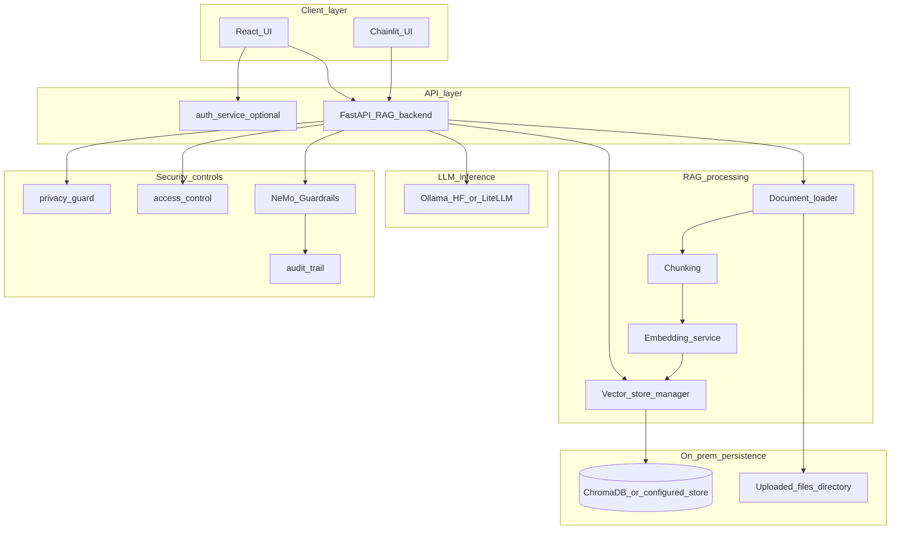

# Security data flow and compliance notes

**Created:** 2026-03-27

This document complements [SECURITY.md](SECURITY.md) with a **data lifecycle diagram** and **high-level compliance readiness** notes. It reflects the implementation in this repository; it is **not** legal advice. Deployments in regulated environments need organisation-specific policies, contracts, and assessments.

## Data flow (on-premises RAG)

The diagram shows where document bytes, chunks, embeddings, and query traffic move in a typical single-tenant on-prem setup. Exact ports and services depend on your `docker-compose` or bare-metal layout (see [DEPLOYMENT.md](../DEPLOYMENT.md) and [docs/DOCKER_TECHNICAL.md](../DOCKER_TECHNICAL.md)).

### Stages (what lives where)

| Stage | Data | Typical location |
| ----- | ---- | ---------------- |
| Upload | Original files (PDF, DOCX, …) | Configured upload directory on disk |
| Indexing | Chunks and embeddings | Vector store (default: local ChromaDB) |
| Query | User question, retrieved chunks, generated answer | Memory / process; logs may go to audit pipeline |
| Erasure | User-triggered delete | `DELETE /api/documents/{filename}` removes file and associated vectors (see [documents.py](../../src/backend/rag_pipeline/api/documents.py)) |

## GDPR / AVG (EU)

**What the product helps with**

- **Data residency:** Core RAG flows are designed to run **on your infrastructure**; embeddings and LLM calls can stay local when you configure local models and stores.
- **Purpose limitation / documentation:** Technical docs describe components; your organisation defines lawful basis and purposes in policy.
- **Erasure (Article 17):** Document deletion via the API removes the **file** and **vector store rows** tied to that document name. You must also handle backups, replicas, logs, and any copies outside this app.
- **Security of processing (Article 32):** Authentication, access control, audit, and guardrails are implemented as code; you must configure secrets, TLS, network policy, and hardening for production.

**Operator responsibilities**

- Identity lifecycle, consent where required, DPIA, DPA with subprocessors, retention schedules, incident response, and data subject requests beyond a single-document delete.

## NEN 7510 (Netherlands healthcare information security)

NEN 7510 is an **organisational and system** standard. This codebase provides **building blocks** (access control concepts, audit entities, on-prem deployment), but **does not** by itself prove NEN 7510 compliance.

**Readiness angle**

- Map controls to your ISMS: access rules in `access_control/`, logging in `audit_trail/`, optional auth service for identity.
- Run your own risk analysis and supplier assessments for third-party components (Ollama, models, OS).

## DPIA readiness (Data Protection Impact Assessment)

A DPIA is required when processing is likely to result in high risk to individuals (GDPR Article 35). Software cannot replace the assessment, but you can attach this checklist to your DPIA evidence:

| Topic | In-repo support |
| ----- | ---------------- |
| Description of processing | See data flow diagram above and [SECURITY.md](SECURITY.md) |
| Necessity / proportionality | Product goal: local RAG with citations; scope is deployment-specific |
| Risks to individuals | Misconfiguration, weak auth, model hallucination, residual data in logs |
| Mitigations | On-prem deployment, RBAC, audit trail, guardrails, PII-related utilities, document deletion API |
| Consultation / DPO | Organisation-specific |

## References

- [SECURITY.md](SECURITY.md) — security architecture and code map
- [../AUTHENTICATION_AUTORISATION.md](../AUTHENTICATION_AUTORISATION.md) — auth service
- [../../SECURITY.md](../../SECURITY.md) — vulnerability reporting

## Code Files

- [src/backend/rag_pipeline/api/documents.py](../../src/backend/rag_pipeline/api/documents.py) — upload, list, delete (including vector purge)
