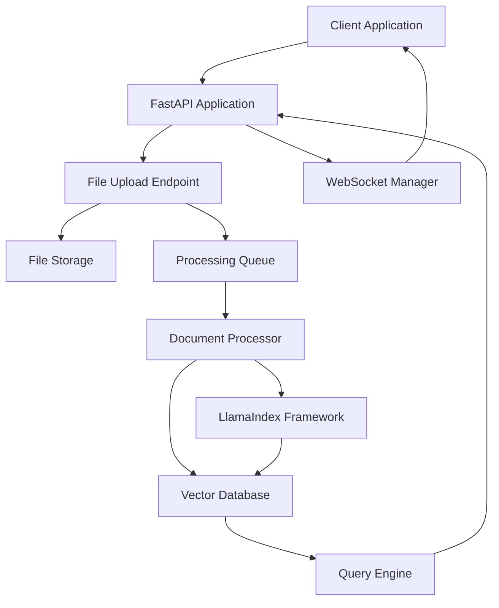

# Document Processing Pipeline Architecture

**Story**: [STORY-002: Document Processing Pipeline](../project/team/stories/STORY-002.md)  
**Task**: [TASK-006A: Design Document Processing Architecture](../project/team/tasks/TASK-006A.md)  
**Designer**: Software Architect  
**Date**: 2025-09-11  
**Status**: Draft

## Executive Summary

This document defines the architecture for the document processing pipeline that enables users to upload, process, and query documents using the LlamaIndex framework. The architecture supports real-time progress updates via WebSocket communication and provides a robust FastAPI-based REST API.

## Architecture Overview



## Component Architecture

### 1. FastAPI Application Structure

#### Main Application Setup

```python
# src/backend/rag_pipeline/file_ingestion.py
from fastapi import FastAPI, WebSocket, UploadFile, File
from fastapi.middleware.cors import CORSMiddleware
from fastapi.responses import JSONResponse
import asyncio
from typing import Dict, List
```

#### Route Organization

- `/api/v1/upload` - File upload endpoint
- `/api/v1/status/{task_id}` - Processing status endpoint
- `/api/v1/query` - Document query endpoint
- `/ws/progress` - WebSocket progress updates

#### Middleware Configuration

- CORS middleware for cross-origin requests
- Request logging middleware
- Error handling middleware
- Authentication middleware (future)

### 2. File Upload System

#### Upload Endpoint Design

```python
@router.post("/upload")
async def upload_documents(
    files: List[UploadFile] = File(...),
    background_tasks: BackgroundTasks
) -> JSONResponse:
    """
    Upload multiple documents for processing.

    Returns:
        - task_id: Unique identifier for tracking progress
        - accepted_files: List of successfully uploaded files
        - rejected_files: List of files that failed validation
    """
```

#### File Validation Pipeline

1. **File Type Validation**: Check MIME types (PDF, DOCX, MD, TXT)
2. **Size Validation**: Enforce maximum file size limits
3. **Security Validation**: Scan for malicious content
4. **Duplicate Detection**: Check for already processed files

#### Temporary Storage Strategy

- **Local Storage**: Temporary files stored in `data/uploads/`
- **Cleanup**: Automatic cleanup after processing completion
- **Security**: Files are isolated and access-controlled

### 3. WebSocket Communication

#### Progress Update Mechanism

```python
class ProgressManager:
    def __init__(self):
        self.connections: Dict[str, WebSocket] = {}
        self.progress: Dict[str, ProcessingProgress] = {}

    async def send_progress(self, task_id: str, progress: ProcessingProgress):
        """Send progress update to connected clients."""
```

#### Connection Management

- **Connection Pool**: Track active WebSocket connections
- **Heartbeat**: Periodic ping/pong to detect disconnections
- **Reconnection**: Client can reconnect and resume progress tracking

#### Client-Server Protocol

```json
{
  "type": "progress_update",
  "task_id": "uuid-string",
  "status": "processing|completed|error",
  "progress": 0.75,
  "current_file": "document.pdf",
  "message": "Processing document.pdf (3/4)"
}
```

### 4. Document Processing Pipeline

#### LlamaIndex Integration Points

```python
from llama_index.core import (
    SimpleDirectoryReader,
    VectorStoreIndex,
    StorageContext,
    load_index_from_storage
)

class DocumentProcessor:
    def __init__(self):
        self.llama_index = LlamaIndexManager()
        self.vector_store = ChromaVectorStore()

    async def process_documents(self, files: List[str]) -> ProcessingResult:
        """Process uploaded documents using LlamaIndex."""
```

#### File Type Handlers

- **PDF**: Use PyPDF2 or pdfplumber for text extraction
- **DOCX**: Use python-docx for document processing
- **MD**: Direct text processing
- **TXT**: Direct text processing

#### Processing Workflow

1. **File Ingestion**: Read and validate files
2. **Text Extraction**: Extract text content from files
3. **Chunking**: Split text into manageable chunks
4. **Embedding**: Generate vector embeddings
5. **Indexing**: Store in vector database
6. **Metadata**: Store document metadata

### 5. Data Models

#### Document Metadata Structure

```python
from pydantic import BaseModel
from typing import Optional, List
from datetime import datetime

class DocumentMetadata(BaseModel):
    id: str
    filename: str
    file_type: str
    size: int
    upload_time: datetime
    processing_status: str
    chunk_count: Optional[int] = None
    error_message: Optional[str] = None
```

#### Processing Status Tracking

```python
class ProcessingProgress(BaseModel):
    task_id: str
    status: str  # pending|processing|completed|error
    progress: float  # 0.0 to 1.0
    current_file: Optional[str] = None
    total_files: int
    processed_files: int
    message: Optional[str] = None
    error_details: Optional[Dict] = None
```

#### API Response Schemas

```python
class UploadResponse(BaseModel):
    task_id: str
    accepted_files: List[str]
    rejected_files: List[Dict[str, str]]
    message: str

class QueryResponse(BaseModel):
    query: str
    results: List[DocumentResult]
    processing_time: float
    total_results: int
```

## Technical Decisions

### Framework Integration

- **LlamaIndex**: Use as the core document processing framework
- **FastAPI**: REST API and WebSocket handling
- **ChromaDB**: Vector storage and retrieval
- **Pydantic**: Data validation and serialization

### File Storage Strategy

- **Temporary Storage**: Local filesystem for uploaded files
- **Vector Storage**: ChromaDB for embeddings and metadata
- **Cleanup**: Automatic cleanup after processing

### Progress Tracking

- **Granularity**: File-level progress tracking
- **Frequency**: Real-time updates via WebSocket
- **Persistence**: Store progress in memory with optional database persistence

### Error Handling

- **Classification**: File-level and system-level errors
- **Recovery**: Retry mechanism for transient failures
- **Reporting**: Detailed error messages for debugging

### Scalability Considerations

- **Async Processing**: Use asyncio for non-blocking operations
- **Queue System**: Background task processing
- **Resource Management**: Memory and CPU usage monitoring
- **Horizontal Scaling**: Design for multiple worker processes

## Integration Points

### LlamaIndex Framework

- **Document Loaders**: Custom loaders for different file types
- **Text Splitters**: Configurable chunking strategies
- **Embeddings**: Integration with embedding models
- **Vector Stores**: ChromaDB integration
- **Query Engines**: RAG query processing

### Existing Components

- **Authentication Service**: Integration with auth_service
- **Vector Database**: ChromaDB for document storage
- **File System**: Local storage for temporary files

## Security Considerations

### File Upload Security

- **File Type Validation**: Strict MIME type checking
- **Size Limits**: Maximum file size enforcement
- **Malware Scanning**: Basic content validation
- **Access Control**: User-based file access

### Data Protection

- **Encryption**: Encrypt sensitive data at rest
- **Access Logging**: Log all file access and processing
- **Data Retention**: Configurable data retention policies

## Performance Requirements

### Processing Performance

- **Throughput**: Support concurrent file processing
- **Latency**: Real-time progress updates
- **Memory Usage**: Efficient memory management for large files

### API Performance

- **Response Time**: < 200ms for status queries
- **WebSocket Latency**: < 100ms for progress updates
- **Concurrent Users**: Support 10+ concurrent uploads

## Monitoring and Observability

### Metrics

- **Processing Time**: Track document processing duration
- **Success Rate**: Monitor processing success/failure rates
- **Resource Usage**: CPU, memory, and disk usage
- **API Performance**: Response times and error rates

### Logging

- **Structured Logging**: JSON-formatted logs
- **Log Levels**: DEBUG, INFO, WARNING, ERROR
- **Correlation IDs**: Track requests across components

## Future Enhancements

### Phase 2 Features

- **Batch Processing**: Support for large document batches
- **Advanced Chunking**: Semantic chunking strategies
- **Multi-language Support**: Support for non-English documents
- **Custom Embeddings**: Integration with custom embedding models

### Phase 3 Features

- **Distributed Processing**: Multi-node processing support
- **Advanced Analytics**: Document processing analytics
- **API Versioning**: Support for multiple API versions
- **Rate Limiting**: Advanced rate limiting and throttling

## Implementation Plan

### Phase 1: Core Architecture (TASK-006A)

1. Design FastAPI application structure
2. Implement file upload system
3. Set up WebSocket communication
4. Integrate LlamaIndex framework
5. Create data models and schemas

### Phase 2: Implementation (TASK-006B, TASK-006C, TASK-006D)

1. Implement FastAPI endpoints
2. Implement WebSocket progress updates
3. Integrate LlamaIndex document processing
4. Add comprehensive testing

### Phase 3: Testing and Validation (TASK-006E)

1. Create comprehensive test suite
2. Performance testing
3. Security testing
4. Integration testing

## Dependencies

### External Dependencies

- **FastAPI**: Web framework
- **LlamaIndex**: Document processing framework
- **ChromaDB**: Vector database
- **WebSocket**: Real-time communication
- **Pydantic**: Data validation

### Internal Dependencies

- **Authentication Service**: User authentication
- **Vector Database**: Document storage
- **File System**: Temporary file storage

## Risk Assessment

### Technical Risks

- **LlamaIndex Integration**: Complex framework integration
- **WebSocket Reliability**: Connection management challenges
- **File Processing**: Large file handling and memory usage
- **Performance**: Scalability under load

### Mitigation Strategies

- **Prototype Development**: Build proof-of-concept first
- **Incremental Implementation**: Implement components incrementally
- **Comprehensive Testing**: Extensive testing at each phase
- **Performance Monitoring**: Continuous performance monitoring

## Conclusion

This architecture provides a robust foundation for the document processing pipeline, supporting real-time progress updates, comprehensive error handling, and scalable document processing using the LlamaIndex framework. The design emphasizes modularity, maintainability, and future extensibility.

---

**Next Steps**:

1. Review and approve architecture design
2. Begin implementation with TASK-006B (FastAPI Implementation)
3. Set up development environment and dependencies
4. Create initial project structure and scaffolding
